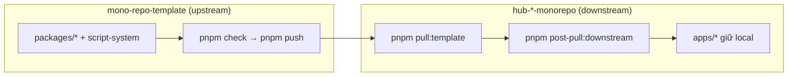

# AGENTS — Entry point (mono-repo-template)

Tài liệu này là **chỉ mục điều hướng** cho agent: hiểu hệ thống → chọn đúng folder → mở đúng doc → làm việc.  
**Mô hình template:** [`docs/TEMPLATE_MONOREPO.md`](docs/TEMPLATE_MONOREPO.md) — **`packages/` = thư viện đầy đủ**; downstream kéo qua `pnpm pull:template`; apps chỉ compose.  
**Không** nhân bản chi tiết dài ở đây; mỗi chủ đề có file riêng trong `docs/` hoặc `packages/*/README.md`.

**Ngôn ngữ & encoding:** tài liệu agent dùng **tiếng Việt**, file Markdown lưu **UTF-8** (không mojibake kiểu `M?c tiêu`, `Ðây`). Khi sửa doc, giữ UTF-8; không tạo file `.md` mới ngoài cây `docs/` / README package trừ khi có chủ đề lặp lại (mục 4).

---

## 1. Bản đồ monorepo (đường dẫn thật)

```
apps/
├── main/                          # Source of truth — dev hàng ngày
│   ├── api/          @api
│   └── backend/      @backend
├── hub-parent/                    # Deploy site chính
│   ├── api/          @hub-parent/api
│   └── hub-parent-frontend/       @frontend
├── hub-event/                     # Deploy check-in
│   ├── api/          @hub-event/api
│   └── hub-event-checkin-frontend/ @hub-event-checkin-frontend
└── store-sync/
    ├── api/          @store-sync/api
    └── store-sync-frontend/       @store-sync-frontend

packages/                          # Logic dùng chung (@workspace/*)
script-system/                     # sync, verify, graphify, generate — xem script-system/README.md
```

| Shorthand cũ (trong doc legacy) | Đường dẫn hiện tại | Package npm |
|--------------------------------|---------------------|-------------|
| `apps/api` | `apps/main/api` | `@api` |
| `apps/backend` | `apps/main/backend` | `@backend` |
| `apps/frontend` | `apps/hub-parent/hub-parent-frontend` | `@frontend` |

Chi tiết workflow product line: [`docs/MONOREPO_STRUCTURE.md`](docs/MONOREPO_STRUCTURE.md) · quy tắc `apps/`: [`apps/README.md`](apps/README.md).

---

## 2. Quy trình bắt buộc trước khi sửa code

1. [`docs/admin-pattern/PRE_CODE_PROTOCOL.md`](docs/admin-pattern/PRE_CODE_PROTOCOL.md)
2. **Brief task (khuyến nghị):** `pnpm graphify:brief --task "mô tả ngắn"` — reading list + file ưu tiên
3. Các doc theo **loại task** (mục 3 + [`.graphify/markdown/TASK_INDEX.md`](.graphify/markdown/TASK_INDEX.md))
4. Sau khi sửa: `pnpm check` + DoD (mục 6)

Lộ trình step-by-step đầy đủ: [`docs/steps/`](docs/steps/) (`step1` → `step10`).  
Index tài liệu: [`docs/README.md`](docs/README.md).

---

## 3. Chọn tài liệu theo task

| Loại task | Đọc trước (theo thứ tự) | Sửa code tại |
|-----------|-------------------------|--------------|
| **Admin page (main)** | `PRE_CODE_PROTOCOL` → `ADMIN_PAGE_PATTERN.md` → `docs/pages/README.md` → graphify `apps/main/backend` | `apps/main/backend/` |
| **API Nest (main, dev)** | `PRE_CODE_PROTOCOL` → `docs/api-pattern/README.md` → graphify `apps/main/api` | `apps/main/api/` |
| **Storefront HUB** | `FRONTEND_UX.md` → graphify `apps/hub-parent/hub-parent-frontend` | `apps/hub-parent/hub-parent-frontend/` |
| **Check-in (deploy line)** | `MONOREPO_STRUCTURE.md` → `ADMIN_APP_PACKAGE.md` → [`docs/api-pattern/HANET.md`](docs/api-pattern/HANET.md) → mục **api-server** bên dưới | `apps/hub-event/api/`, `apps/hub-event/hub-event-checkin-frontend/` |
| **HANET Partner API** | [`docs/api-pattern/HANET.md`](docs/api-pattern/HANET.md) → `docs/env/README.md` (mục HANET) → `hanet-postman.ts` | `apps/main/api/src/hanet/`, `packages/api-client/src/resources/hanet.ts` |
| **Store Sync** | `MONOREPO_STRUCTURE.md` → graphify `apps/store-sync/*` | `apps/store-sync/` |
| **Package UI** | `docs/ui-pattern/README.md` + `ADMIN_PAGE_PATTERN.md` | `packages/ui/` |
| **API client** | `docs/api-client-pattern/README.md` (+ `REALTIME.md` nếu socket) | `packages/api-client/` |
| **API server (logic chung)** | `packages/api-server/README.md` + `docs/api-pattern/README.md` | `packages/api-server/` |
| **Admin CRUD dùng chung** | `docs/admin-pattern/ADMIN_APP_PACKAGE.md` | `packages/admin-app/` + generate ở app |
| **Env / deploy** | `docs/env/README.md` · PM2: `README.md` (mục PM2) | `.env.example` từng app |
| **Upload / disk / seed JSON** | `docs/storage/README.md` · `data/README.md` | `STORAGE_DIR`, `data/seed/` |

### Graphify — mở đúng app

| App | `SUMMARY_FOR_AI.md` |
|-----|---------------------|
| Monorepo (chỉ mục) | [`.graphify/markdown/SUMMARY_FOR_AI.md`](.graphify/markdown/SUMMARY_FOR_AI.md) |
| Packages | [`packages/.graphify/markdown/SUMMARY_FOR_AI.md`](packages/.graphify/markdown/SUMMARY_FOR_AI.md) |
| Main API | [`apps/main/api/.graphify/markdown/SUMMARY_FOR_AI.md`](apps/main/api/.graphify/markdown/SUMMARY_FOR_AI.md) |
| Main admin | [`apps/main/backend/.graphify/markdown/SUMMARY_FOR_AI.md`](apps/main/backend/.graphify/markdown/SUMMARY_FOR_AI.md) |
| Hub storefront | [`apps/hub-parent/hub-parent-frontend/.graphify/markdown/SUMMARY_FOR_AI.md`](apps/hub-parent/hub-parent-frontend/.graphify/markdown/SUMMARY_FOR_AI.md) |
| Check-in API | [`apps/hub-event/api/.graphify/markdown/SUMMARY_FOR_AI.md`](apps/hub-event/api/.graphify/markdown/SUMMARY_FOR_AI.md) |
| Check-in frontend | [`apps/hub-event/hub-event-checkin-frontend/.graphify/markdown/SUMMARY_FOR_AI.md`](apps/hub-event/hub-event-checkin-frontend/.graphify/markdown/SUMMARY_FOR_AI.md) |
| Store Sync | `apps/store-sync/*/.graphify/markdown/SUMMARY_FOR_AI.md` |

Sau `SUMMARY_FOR_AI.md`, dùng **Chỉ dẫn theo chủ đề** trong cùng file → `FOLDER_TREE.md` / `GRAPH_STATS.md` / `IMPACT_RADIUS.md` / `ENTRY_POINTS.md` / `API_DOMAIN_IMPORTS.md` / `WORKSPACE_DEPS.md`.  
Chỉ mở `snapshot/context.json` khi cần trích đoạn cụ thể. Làm mới: `pnpm graphify:refresh` · skill: [`.cursor/skills/hub-graphify-standardize-loop/SKILL.md`](.cursor/skills/hub-graphify-standardize-loop/SKILL.md).

### 3.1 Graph + task — file cụ thể

| Artefact / lệnh | Khi nào dùng |
|-----------------|--------------|
| [`.graphify/markdown/TASK_INDEX.md`](.graphify/markdown/TASK_INDEX.md) | Biết module X → folder/file (`admin-app`, `main/api`, `api-client`) |
| `pnpm graphify:brief --task "..."` | Đầu task — brief đọc/verify/sync (sinh từ `task-index.json`) |
| `TASK_INDEX` cột Check-in API | Domain có trên hub-event sau `pull:checkin` hay chỉ main |
| [`.graphify/markdown/SYNC_DELTA.md`](.graphify/markdown/SYNC_DELTA.md) | So sánh domain `main/api` ↔ `hub-event/api` (exclude + native) |
| `apps/<app>/.graphify/markdown/IMPACT_RADIUS.md` | Sửa helper/shared — xem ai import file đó |
| `apps/<app>/.graphify/markdown/ENTRY_POINTS.md` | Bootstrap, route Next, file AUTO-GENERATED |
| [`.graphify/markdown/ROUTE_SURFACE.md`](.graphify/markdown/ROUTE_SURFACE.md) | Admin URL ↔ Nest API ↔ api-client HTTP |
| `apps/<app>/.graphify/markdown/PATTERN_CLUSTERS.md` | Boilerplate lặp (loading, re-export generate) |
| [`packages/.graphify/markdown/PACKAGE_INDEX.md`](packages/.graphify/markdown/PACKAGE_INDEX.md) | Graphify `ui`, `admin-app`, `api-client`, `api-server` |

```bash
pnpm graphify:brief --task "sửa filter admin screens"
pnpm graphify:brief --task "API events check-in"
```

### Package — doc bổ trợ

| Package | Doc |
|---------|-----|
| `@workspace/ui` | `docs/ui-pattern/README.md` |
| `@workspace/api-client` | `docs/api-client-pattern/README.md` |
| `@workspace/api-server` | `packages/api-server/README.md` |
| `@workspace/admin-app` | `docs/admin-pattern/ADMIN_APP_PACKAGE.md` |
| `@workspace/query-client` | `docs/query-client-pattern/README.md` |
| `@workspace/logger` | `docs/logger-pattern/README.md` |
| `@thangph2146/lexical-editor` | `packages/editor/README.md` |

---

## 4. Cây tài liệu `docs/` (không tạo file md lung tung)

```
docs/
├── README.md                 # Index docs/
├── MONOREPO_STRUCTURE.md     # Product lines, sync, dev stacks
├── steps/step1..step10.md    # Lộ trình agent (đọc tuần tự khi mới vào repo)
├── admin-pattern/            # Kiến trúc, protocol, admin UX, microservice map
├── pages/                    # Guide implementation theo feature admin
├── api-pattern/              # Nest API (pattern — áp dụng main + api-server)
├── api-client-pattern/       # SDK + realtime
├── ui-pattern/               # packages/ui
├── env/                      # Biến môi trường, pnpm env:init
└── logger-pattern/, query-client-pattern/
```

**Quy tắc:** thêm doc mới chỉ khi có **chủ đề lặp lại** hoặc **ranh giới kiến trúc**; feature một lần → `docs/pages/<feature>.md` hoặc README package, không duplicate vào `AGENTS.md`.

---

## 5. Dev & sync (tóm tắt)

### Quy tắc vàng: **template trước → downstream sau**



| Bước | Repo | Lệnh |
|------|------|------|
| **1. Sửa thư viện** | `mono-repo-template` | `packages/*`, `script-system/*` |
| **2. Verify + push** | upstream | `pnpm check` → `pnpm push -- "feat: ..."` |
| **3. Đồng bộ** | downstream | `pnpm sync` (= `pull:template` + `post-pull:downstream`) |
| **4. Verify deploy** | downstream | `pnpm check` hoặc `pnpm sync:full` |

**Không** sửa `packages/` lâu dài trên downstream — PR lên template upstream.  
**Không** chạy `pnpm sync` downstream trước khi upstream đã push `main`.

Profile post-pull theo `productLine`: `script-system/sync/downstream-sync-profile.cjs`  
(hub-event → `pull:checkin`; hub-parent → build; store-sync → `admin:generate:store`).

| Mục đích | Lệnh |
|----------|------|
| Dev site chính | `pnpm dev` (main API + backend + hub-parent frontend) |
| Dev parent line (hub-parent API + frontend) | `pnpm dev:parent` |
| Dev check-in UI + **main API** | `pnpm dev:main:checkin` |
| Dev stack check-in deploy | `pnpm dev:checkin` |
| **Push template upstream** | `pnpm push -- "feat: ..."` (chỉ `main`) |
| Downstream kéo **full packages/** | `pnpm pull:template` · `pnpm sync` · catalog [`packages/README.md`](packages/README.md) |
| Legacy branch deploy | `pnpm push:legacy` / `push:checkin` / `push:parent` |
| Sync check-in (verify + admin; API native đã commit) | `pnpm pull:checkin` |
| Cập nhật hub-event API từ main (dev) | `pnpm api:sync-template` rồi `pnpm api:render apps/hub-event/api` → commit |
| Copy API main → hub-event (deprecated) | `pnpm pull:checkin:legacy` |
| Env | `pnpm env:init` · `pnpm verify:env` |

**`pnpm dev:parent` (quan trọng):** chỉ chạy **2 app** của parent line: `apps/hub-parent/api` + `apps/hub-parent/hub-parent-frontend`. Frontend parent có route `/admin` (redirect sang admin URL), nên chỉ hiển thị/chạy chức năng liên quan parent line; không dùng để kiểm tra toàn bộ admin cross-line như `apps/main/backend` hoặc check-in.  

**Dev hàng ngày (upstream):** sửa `packages/admin-app` / `packages/api-server` / `packages/*`, tag template.  
**Repo chính deploy:** **hub-event-monorepo** — `pnpm dev:checkin`, `pnpm pull:template`.

---

## 6. Lệnh kiểm tra bắt buộc

```bash
pnpm check                    # verify + lint + typecheck
pnpm check:full               # check + graphify:ai-summary (sau đổi kiến trúc lớn)
pnpm graphify:brief --task "..."  # định vị task (trước khi sửa)
pnpm verify:bounds            # không import chéo apps/*
pnpm verify:imports           # alias @ui
```

### Definition of Done (agent)

| Tiêu chí | Cách kiểm |
|----------|-----------|
| Đúng product line | `graphify:brief` hoặc mục 3 — dev: `apps/main/*`; check-in: + `pnpm pull:checkin` |
| Đúng chỗ sửa | `TASK_INDEX` / brief — không sửa generated trừ khi chạy lại generate |
| Ranh giới service | `pnpm verify:bounds` (trong `pnpm check`) |
| API ↔ client khớp | `pnpm verify:api-contract` khi đổi API hoặc `@workspace/api-client` |
| Admin generate khớp | `pnpm verify:main-admin` / `verify:checkin-admin` |
| Check-in API materialize | `pnpm verify:api-template` + `pnpm verify:checkin-api` · cập nhật: `pnpm api:sync-template && pnpm api:render apps/hub-event/api` |
| Unified module parity | `pnpm verify:main-api-endpoint-parity` khi đổi `Base*Controller` trong package |
| Build sạch | `pnpm check` pass |
| Graph còn mới | `generatedAt` trong SUMMARY / TASK_INDEX sau đổi cấu trúc → `pnpm graphify:refresh` |
| Deploy branch cập nhật | Downstream: `pnpm pull:template` · Legacy: `pnpm push:legacy` |

### Push (template upstream)

```bash
pnpm push -- "feat: mô tả"
```

Chỉ push **`main`**. Downstream kéo packages: `pnpm pull:template` — xem [`docs/TEMPLATE_MONOREPO.md`](docs/TEMPLATE_MONOREPO.md).

Sau đổi route/module đáng kể:

```bash
node script-system/graphify/graphify-update.cjs apps/<app>
pnpm graphify:ai-summary
# hoặc: pnpm graphify:refresh
```

---

## 7. `@workspace/admin-app` (admin frontend)

Logic CRUD admin → **`packages/admin-app`**. App chỉ `admin.app.config.json` + generate.

```bash
pnpm admin:migrate
pnpm admin:generate:main
pnpm admin:generate:checkin
pnpm verify:main-admin
pnpm verify:checkin-admin
```

Main: `apps/main/backend/admin.app.config.json`  
Check-in: `apps/hub-event/hub-event-checkin-frontend/admin.app.config.json`  
Chi tiết: [`docs/admin-pattern/ADMIN_APP_PACKAGE.md`](docs/admin-pattern/ADMIN_APP_PACKAGE.md).

---

## 8. `@workspace/api-server` (API Nest dùng chung)

Pattern song song admin-app:

| Admin (Next) | API (Nest) |
|--------------|------------|
| `admin.app.config.json` | `api.app.config.json` (`apps/hub-event/api/`) |
| `pnpm admin:generate:checkin` | **`pnpm api:render:checkin`** (verify) · config trong `packages/api-server/deploy/config/` |

```bash
pnpm api:sync-template              # @workspace/api-server/deploy/cli/sync-template.cjs
pnpm api:render apps/hub-event/api
pnpm verify:api-template            # packages/api-server/deploy/cli/verify/
pnpm verify:checkin-api
pnpm verify:main-api-endpoint-parity
```

### API render theo graph/config chuẩn (bắt buộc)

1. Định vị product line + module scope bằng graph:
   - `pnpm graphify:brief --task "api render <line>"`
   - đọc `.graphify/markdown/TASK_INDEX.md` + `SYNC_DELTA.md` (nếu sync main ↔ hub-event).
2. Sync template trước khi render line:
   - `pnpm api:sync-template`
3. Render theo `api.app.config.json` của từng app (không render mù toàn module):
   - mặc định: `pnpm api:render apps/<line>/api --prune`
   - cần khóa entity theo closure graph: `pnpm api:render apps/<line>/api --prune --prune-entities`
4. Verify bắt buộc sau render:
   - `pnpm verify:api-template`
   - `pnpm --filter @workspace/api-server run verify:entity-closure`

Nếu gặp lỗi Windows kiểu `UNKNOWN: unknown error, open ...PACKAGE_MODULE_TEMPLATES.meta.json`:
- chạy lại `pnpm api:sync-template` (pipeline đã có retry ghi file meta),
- tránh chạy đồng thời nhiều lệnh render/sync vào cùng `deploy/nest/.pipeline/`.

- **Template OOP:** `packages/api-server/deploy/nest/` · **Config:** `packages/api-server/deploy/config/`
- **Base* template:** `src/modules/` (registry) → `module-bases/` (active thin, copy khi render) · `package-module-templates.cjs` · `.pipeline/PACKAGE_MODULE_TEMPLATES.meta.json`
- **Materialize:** `thin` (extends Base* module-bases, vd. `users`) · `crud` (`common/crud`, 13 module) · `mirror` (copy `main/api`)
- **`main/api`:** auth/system native — app deploy **không** import runtime `@workspace/api-server/modules/*`

Chi tiết: [`packages/api-server/README.md`](packages/api-server/README.md).

```bash
pnpm test:api-server
pnpm verify:api-contract
```

---

## 9. Ranh giới & import (tóm tắt)

- Không import chéo `apps/*` · Next ↔ API qua `@workspace/api-client`
- Admin UI: `@ui/components/...` — không tạo component admin local trong app
- API Nest: `@workspace/*` — không `@ui` / React
- Nguồn alias: `script-system/lib/import-alias-rules.cjs` · ESLint: `packages/eslint-config/service-boundaries.js`

Map đầy đủ: [`docs/admin-pattern/MICROSERVICE_SYSTEM_MAP.md`](docs/admin-pattern/MICROSERVICE_SYSTEM_MAP.md).

### Pattern bắt buộc

- Mutation admin: `useAdminMutation` (`packages/ui`) — không toast thủ công trong `onSuccess`/`onError`
- Realtime: `docs/api-client-pattern/REALTIME.md`
- Import `/admin/data`: client `apps/main/backend/src/app/data/_component/` · API `BaseSystemService` (main + hub-event binding)

---

## 10. Quy tắc chống duplicate (đọc trước khi thêm file)

**Một nguồn sự thật — không copy logic giữa app và package.**

| Loại | Sửa tại (source of truth) | App (`apps/*/api` hoặc backend) chỉ |
|------|---------------------------|-------------------------------------|
| CRUD admin UI | `packages/admin-app` | `admin.app.config.json` + page AUTO-GENERATED re-export |
| HTTP admin + service logic (unified) | `packages/api-server` (`Base*Service`, `Base*Controller`) | Subclass: `getEm()`, `getEntity()`, `mapRow`, inject constructor |
| HTTP/service chưa unified | `apps/main/api` (dev) → port vào package trước khi generate hub-event | Không copy ngược từ hub-event sang main |
| Entity / migration / seed | App API tương ứng | Không đưa entity vào `packages/` |
| Component UI | `packages/ui` (`@ui/components/...`) | Không tạo admin component local |
| API HTTP từ Next | `packages/api-client` | Không `fetch` / `sdk.http` trực tiếp |

**Luồng quyết định (agent):**

1. Feature dùng trên **hub-event** → implement trong `packages/api-server` hoặc `packages/admin-app` trước.
2. Chạy generate: **`pnpm api:render:checkin`** (hub-event API) / `pnpm admin:generate:checkin` — **không** sửa tay file có banner `AUTO-GENERATED` (override qua `api.app.config.json` → `native.*` hoặc registry).
3. **Main API:** `system` + `auth` đã extend package; CRUD còn lại native — khi port, xóa bản copy trong `apps/main/api`, không giữ song song.
4. **Downstream** (`hub-event-monorepo`): `pnpm pull:template` — không chạy `pull:checkin:legacy`.

**Cấm:** file dump/export JSON trong `src/`, duplicate type (`StorageMediaKind`…), controller `*-admin.controller.ts` song song với unified `*.controller.ts`, doc mới trùng nội dung mục 3–9.

Chi tiết check-in: [`apps/hub-event/README.md`](apps/hub-event/README.md) · template: [`docs/TEMPLATE_MONOREPO.md`](docs/TEMPLATE_MONOREPO.md).

---

## 11. PM2 production (3 stack — không chạy cùng lúc)

Nguồn sự thật: [`ecosystem/`](ecosystem/README.md) — CLI: `node ecosystem/pm2-stack.cjs`.

| Stack | File PM2 | Apps |
|-------|----------|------|
| Site chính | `ecosystem/main.cjs` | hub-parent-api :3002, hub-parent-backend :3001, hub-parent-frontend :3000 |
| Check-in | `ecosystem/checkin.cjs` | hub-checkin-api :3002, hub-checkin-frontend :3000 |
| Store sync | `ecosystem/store.cjs` | hub-store-api :3002, hub-store-frontend :3000 |

```bash
pnpm pm2:start          # site chính
pnpm pm2:start:checkin  # check-in
pnpm pm2:start:store    # store sync
pnpm pm2:reload         # sau pull code
pnpm pm2:delete         # dừng stack tương ứng
```

Kiểm tra layout: `pnpm verify:ecosystem`. Chi tiết deploy, xóa process, chuyển stack: [`README.md`](README.md) (mục PM2).

---

## 12. Đọc thêm (theo thứ tự khi onboarding)

1. [`docs/admin-pattern/README.md`](docs/admin-pattern/README.md)
2. [`docs/admin-pattern/MICROSERVICE_SYSTEM_MAP.md`](docs/admin-pattern/MICROSERVICE_SYSTEM_MAP.md)
3. [`docs/admin-pattern/AGENTS_GUIDE.md`](docs/admin-pattern/AGENTS_GUIDE.md)
4. [`docs/steps/step1_system_overview.md`](docs/steps/step1_system_overview.md)
