# API — phụ thuộc giữa các domain (`src/`)

> **Sinh tự động:** `2026-06-06T18:22:06.722Z` từ `snapshot/graph.json` (cạnh `relation: "imports"`).
> **Domain** = thư mục cấp một dưới `src/` (ví dụ `posts`, `users`). File trực tiếp trong `src/*.ts` gom vào domain `_root`.

Ý nghĩa: **domain hàng gọi (import) domain cột** — Nest module/controller/service trong một feature đang dùng code của feature khác hoặc layer dùng chung (`entities`, `common`, …).

## Bảng phụ thuộc chéo (gộp)

| Domain gọi | Domain được import | Số cạnh import | Ví dụ (tên file) |
|-------------|---------------------|----------------|------------------|
| `_root` | `academic-years` | 1 | app.module.ts → academic-years.module.ts |
| `_root` | `accounts` | 1 | app.module.ts → accounts.module.ts |
| `_root` | `admission-results` | 1 | app.module.ts → admission-results.module.ts |
| `_root` | `auth` | 1 | app.module.ts → auth.module.ts |
| `_root` | `cameras` | 1 | app.module.ts → cameras.module.ts |
| `_root` | `categories` | 1 | app.module.ts → categories.module.ts |
| `_root` | `comments` | 1 | app.module.ts → comments.module.ts |
| `_root` | `common` | 5 | app.module.ts → permissions.guard.ts; main.ts → logging.interceptor.ts; main.ts → database-http-exception.filter.ts; main.ts → request-id.middleware.ts |
| `_root` | `config` | 1 | main.ts → app.config.ts |
| `_root` | `contact-requests` | 1 | app.module.ts → contact-requests.module.ts |
| `_root` | `courses` | 1 | app.module.ts → courses.module.ts |
| `_root` | `dashboard` | 1 | app.module.ts → dashboard.module.ts |
| `_root` | `departments` | 1 | app.module.ts → departments.module.ts |
| `_root` | `entities` | 27 | seed-full-export.ts → account.entity.ts; seed-full-export.ts → admission-result.entity.ts; seed-full-export.ts → category.entity.ts; seed-full-export.ts → comment.entity.ts |
| `_root` | `event-checkins` | 1 | app.module.ts → event-checkins.module.ts |
| `_root` | `event-checkouts` | 1 | app.module.ts → event-checkouts.module.ts |
| `_root` | `event-registrations` | 1 | app.module.ts → event-registrations.module.ts |
| `_root` | `event-speakers` | 1 | app.module.ts → event-speakers.module.ts |
| `_root` | `events` | 1 | app.module.ts → events.module.ts |
| `_root` | `face-data` | 1 | app.module.ts → face-data.module.ts |
| `_root` | `groups` | 1 | app.module.ts → groups.module.ts |
| `_root` | `hanet` | 1 | app.module.ts → hanet.module.ts |
| `_root` | `imported-users` | 1 | app.module.ts → imported-users.module.ts |
| `_root` | `locations` | 1 | app.module.ts → locations.module.ts |
| `_root` | `majors` | 1 | app.module.ts → majors.module.ts |
| `_root` | `messages` | 1 | app.module.ts → messages.module.ts |
| `_root` | `mikro-orm` | 2 | app.module.ts → mikro-orm.module.ts; seed-full-export.ts → orm-entities.ts |
| `_root` | `notifications` | 1 | app.module.ts → notifications.module.ts |
| `_root` | `page-contents` | 1 | app.module.ts → page-contents.module.ts |
| `_root` | `parent-students` | 1 | app.module.ts → parent-students.module.ts |
| `_root` | `posts` | 1 | app.module.ts → posts.module.ts |
| `_root` | `proxy-image` | 1 | app.module.ts → proxy-image.module.ts |
| `_root` | `public` | 1 | app.module.ts → public.module.ts |
| `_root` | `roles` | 1 | app.module.ts → roles.module.ts |
| `_root` | `screens` | 1 | app.module.ts → screens.module.ts |
| `_root` | `seeds` | 1 | seed-superadmin.ts → superadmin-bootstrap.runner.ts |
| `_root` | `seo-metas` | 1 | app.module.ts → seo-metas.module.ts |
| `_root` | `sessions` | 1 | app.module.ts → sessions.module.ts |
| `_root` | `settings` | 1 | app.module.ts → settings.module.ts |
| `_root` | `socket` | 1 | app.module.ts → socket.module.ts |
| `_root` | `speakers` | 1 | app.module.ts → speakers.module.ts |
| `_root` | `students` | 1 | app.module.ts → students.module.ts |
| `_root` | `system` | 2 | app.module.ts → system.module.ts; seed-full-export.ts → import-helpers.ts |
| `_root` | `tags` | 1 | app.module.ts → tags.module.ts |
| `_root` | `templates` | 1 | app.module.ts → templates.module.ts |
| `_root` | `training-levels` | 1 | app.module.ts → training-levels.module.ts |
| `_root` | `training-systems` | 1 | app.module.ts → training-systems.module.ts |
| `_root` | `uploads` | 1 | app.module.ts → uploads.module.ts |
| `_root` | `users` | 1 | app.module.ts → users.module.ts |
| `academic-years` | `common` | 10 | academic-years.controller.ts → permissions.decorator.ts; academic-years.controller.ts → bulk-actions.ts; academic-years.controller.ts → api-response.ts; academic-years.controller.ts → parse-list-query.ts |
| `academic-years` | `config` | 2 | academic-years.controller.ts → permissions.ts; academic-years.controller.ts → constants.ts |
| `academic-years` | `entities` | 1 | academic-years.service.ts → academic-year.entity.ts |
| `accounts` | `common` | 2 | accounts.controller.ts → api-response.ts; accounts.controller.ts → permissions.decorator.ts |
| `accounts` | `config` | 2 | accounts.controller.ts → permissions.ts; accounts.controller.ts → constants.ts |
| `accounts` | `entities` | 5 | accounts.service.spec.ts → user.entity.ts; accounts.service.spec.ts → user-role.entity.ts; accounts.service.spec.ts → role.entity.ts; accounts.service.ts → user.entity.ts |
| `admission-results` | `common` | 5 | admission-results.controller.ts → api-response.ts; admission-results.controller.ts → permissions.decorator.ts; admission-results.controller.ts → parse-list-query.ts; admission-results.service.ts → pagination.ts |
| `admission-results` | `config` | 2 | admission-results.controller.ts → constants.ts; admission-results.controller.ts → permissions.ts |
| `admission-results` | `entities` | 3 | admission-results.controller.ts → notification.entity.ts; admission-results.service.spec.ts → admission-result.entity.ts; admission-results.service.ts → admission-result.entity.ts |
| `admission-results` | `notifications` | 2 | admission-results.controller.ts → notifications.service.ts; admission-results.module.ts → notifications.module.ts |
| `auth` | `common` | 2 | auth-admin.controller.ts → api-response.ts; auth-admin.controller.ts → public.decorator.ts |
| `auth` | `config` | 2 | auth-admin.controller.ts → constants.ts; auth.service.ts → constants.ts |
| `auth` | `entities` | 7 | auth.service.spec.ts → user.entity.ts; auth.service.spec.ts → role.entity.ts; auth.service.spec.ts → user-role.entity.ts; auth.service.ts → user.entity.ts |
| `cameras` | `common` | 9 | cameras.controller.ts → permissions.decorator.ts; cameras.controller.ts → api-response.ts; cameras.controller.ts → bulk-actions.ts; cameras.controller.ts → parse-list-query.ts |
| `cameras` | `config` | 2 | cameras.controller.ts → permissions.ts; cameras.controller.ts → constants.ts |
| `cameras` | `entities` | 2 | cameras.service.ts → camera.entity.ts; cameras.service.ts → event.entity.ts |
| `categories` | `common` | 4 | categories.controller.ts → api-response.ts; categories.controller.ts → permissions.decorator.ts; categories.controller.ts → parse-list-query.ts; categories.service.ts → pagination.ts |
| `categories` | `config` | 2 | categories.controller.ts → constants.ts; categories.controller.ts → permissions.ts |
| `categories` | `entities` | 4 | categories.controller.ts → notification.entity.ts; categories.service.spec.ts → category.entity.ts; categories.service.ts → category.entity.ts; categories.service.ts → post-category.entity.ts |
| `categories` | `notifications` | 2 | categories.controller.ts → notifications.service.ts; categories.module.ts → notifications.module.ts |
| `comments` | `common` | 4 | comments.controller.ts → api-response.ts; comments.controller.ts → permissions.decorator.ts; comments.controller.ts → parse-list-query.ts; comments.service.ts → pagination.ts |
| `comments` | `config` | 2 | comments.controller.ts → constants.ts; comments.controller.ts → permissions.ts |
| `comments` | `entities` | 3 | comments.controller.ts → notification.entity.ts; comments.service.spec.ts → comment.entity.ts; comments.service.ts → comment.entity.ts |
| `comments` | `notifications` | 2 | comments.controller.ts → notifications.service.ts; comments.module.ts → notifications.module.ts |
| `common` | `auth` | 1 | permissions.guard.ts → auth.service.ts |
| `common` | `config` | 4 | api-access.middleware.ts → constants.ts; logging.interceptor.ts → app.config.ts; logging.interceptor.ts → constants.ts; permissions.guard.ts → constants.ts |
| `common` | `entities` | 13 | resolve-relation-filters.ts → admission-result.entity.ts; resolve-relation-filters.ts → category.entity.ts; resolve-relation-filters.ts → contact-request.entity.ts; resolve-relation-filters.ts → group.entity.ts |
| `common` | `socket` | 3 | admin-realtime-broadcast.service.ts → socket.gateway.ts; admin-realtime-broadcast.service.ts → socket.types.ts; admin-realtime.interceptor.ts → socket.gateway.ts |
| `contact-requests` | `common` | 6 | contact-requests.controller.ts → admin-realtime-broadcast.service.ts; contact-requests.controller.ts → api-response.ts; contact-requests.controller.ts → permissions.decorator.ts; contact-requests.controller.ts → parse-list-query.ts |
| `contact-requests` | `config` | 2 | contact-requests.controller.ts → constants.ts; contact-requests.controller.ts → permissions.ts |
| `contact-requests` | `entities` | 4 | contact-requests.controller.ts → notification.entity.ts; contact-requests.service.spec.ts → contact-request.entity.ts; contact-requests.service.ts → contact-request.entity.ts; contact-requests.service.ts → user.entity.ts |
| `contact-requests` | `notifications` | 2 | contact-requests.controller.ts → notifications.service.ts; contact-requests.module.ts → notifications.module.ts |
| `contact-requests` | `socket` | 1 | contact-requests.module.ts → socket.module.ts |
| `courses` | `common` | 10 | courses.controller.ts → permissions.decorator.ts; courses.controller.ts → api-response.ts; courses.controller.ts → bulk-actions.ts; courses.controller.ts → parse-list-query.ts |
| `courses` | `config` | 2 | courses.controller.ts → permissions.ts; courses.controller.ts → constants.ts |
| `courses` | `entities` | 1 | courses.service.ts → course.entity.ts |
| `dashboard` | `common` | 2 | dashboard.controller.ts → api-response.ts; dashboard.controller.ts → permissions.decorator.ts |
| `dashboard` | `config` | 2 | dashboard.controller.ts → constants.ts; dashboard.controller.ts → permissions.ts |
| `dashboard` | `entities` | 12 | dashboard.service.ts → category.entity.ts; dashboard.service.ts → comment.entity.ts; dashboard.service.ts → contact-request.entity.ts; dashboard.service.ts → message.entity.ts |
| `departments` | `common` | 9 | departments.controller.ts → permissions.decorator.ts; departments.controller.ts → api-response.ts; departments.controller.ts → bulk-actions.ts; departments.controller.ts → parse-list-query.ts |
| `departments` | `config` | 2 | departments.controller.ts → permissions.ts; departments.controller.ts → constants.ts |
| `departments` | `entities` | 1 | departments.service.ts → department.entity.ts |
| `event-checkins` | `common` | 6 | event-checkins.controller.ts → api-response.ts; event-checkins.controller.ts → permissions.decorator.ts; event-checkins.controller.ts → bulk-actions.ts; event-checkins.controller.ts → parse-list-query.ts |
| `event-checkins` | `config` | 2 | event-checkins.controller.ts → permissions.ts; event-checkins.controller.ts → constants.ts |
| `event-checkins` | `entities` | 3 | event-checkins.service.ts → event-checkin.entity.ts; event-checkins.service.ts → event.entity.ts; event-checkins.service.ts → event-registration.entity.ts |
| `event-checkouts` | `common` | 4 | event-checkouts.controller.ts → api-response.ts; event-checkouts.controller.ts → permissions.decorator.ts; event-checkouts.controller.ts → parse-list-query.ts; event-checkouts.service.ts → pagination.ts |
| `event-checkouts` | `config` | 2 | event-checkouts.controller.ts → permissions.ts; event-checkouts.controller.ts → constants.ts |
| `event-checkouts` | `entities` | 1 | event-checkouts.service.ts → event-registration.entity.ts |
| `event-registrations` | `common` | 6 | event-registrations.controller.ts → api-response.ts; event-registrations.controller.ts → permissions.decorator.ts; event-registrations.controller.ts → bulk-actions.ts; event-registrations.controller.ts → parse-list-query.ts |
| `event-registrations` | `config` | 2 | event-registrations.controller.ts → permissions.ts; event-registrations.controller.ts → constants.ts |
| `event-registrations` | `entities` | 5 | event-registration-attendance.service.ts → event.entity.ts; event-registration-attendance.service.ts → event-registration.entity.ts; event-registrations.service.ts → event-registration.entity.ts; event-registrations.service.ts → event.entity.ts |
| `event-registrations` | `socket` | 3 | event-registration-attendance.service.ts → socket.gateway.ts; event-registration-attendance.service.ts → socket.types.ts; event-registrations.module.ts → socket.module.ts |
| `event-speakers` | `common` | 6 | event-speakers.controller.ts → api-response.ts; event-speakers.controller.ts → permissions.decorator.ts; event-speakers.controller.ts → bulk-actions.ts; event-speakers.controller.ts → parse-list-query.ts |
| `event-speakers` | `config` | 2 | event-speakers.controller.ts → permissions.ts; event-speakers.controller.ts → constants.ts |
| `event-speakers` | `entities` | 3 | event-speakers.service.ts → event-speaker.entity.ts; event-speakers.service.ts → event.entity.ts; event-speakers.service.ts → speaker.entity.ts |
| `events` | `common` | 10 | events.controller.ts → permissions.decorator.ts; events.controller.ts → api-response.ts; events.controller.ts → bulk-actions.ts; events.controller.ts → parse-list-query.ts |
| `events` | `config` | 2 | events.controller.ts → permissions.ts; events.controller.ts → constants.ts |
| `events` | `entities` | 2 | events.service.ts → event.entity.ts; events.service.ts → camera.entity.ts |
| `face-data` | `common` | 6 | face-data.controller.ts → api-response.ts; face-data.controller.ts → permissions.decorator.ts; face-data.controller.ts → bulk-actions.ts; face-data.controller.ts → parse-list-query.ts |
| `face-data` | `config` | 2 | face-data.controller.ts → permissions.ts; face-data.controller.ts → constants.ts |
| `face-data` | `entities` | 2 | face-data.service.ts → face-data.entity.ts; face-data.service.ts → user.entity.ts |
| `groups` | `common` | 3 | groups.controller.ts → api-response.ts; groups.controller.ts → permissions.decorator.ts; groups.controller.ts → parse-list-query.ts |
| `groups` | `config` | 2 | groups.controller.ts → constants.ts; groups.controller.ts → permissions.ts |
| `groups` | `entities` | 8 | groups.controller.ts → notification.entity.ts; groups.service.spec.ts → group.entity.ts; groups.service.spec.ts → group-member.entity.ts; groups.service.ts → group.entity.ts |
| `groups` | `notifications` | 2 | groups.controller.ts → notifications.service.ts; groups.module.ts → notifications.module.ts |
| `groups` | `socket` | 2 | groups.controller.ts → socket.gateway.ts; groups.module.ts → socket.module.ts |
| `hanet` | `common` | 1 | hanet-webhook.controller.ts → public.decorator.ts |
| `hanet` | `config` | 1 | hanet-webhook.controller.ts → constants.ts |
| `hanet` | `entities` | 3 | hanet-webhook.service.ts → event.entity.ts; hanet-webhook.service.ts → event-registration.entity.ts; hanet-webhook.service.ts → camera.entity.ts |
| `hanet` | `event-registrations` | 2 | hanet-webhook.service.ts → event-registration-attendance.service.ts; hanet.module.ts → event-registrations.module.ts |
| `imported-users` | `common` | 6 | imported-users.controller.ts → api-response.ts; imported-users.controller.ts → permissions.decorator.ts; imported-users.controller.ts → bulk-actions.ts; imported-users.controller.ts → parse-list-query.ts |
| `imported-users` | `config` | 2 | imported-users.controller.ts → constants.ts; imported-users.controller.ts → permissions.ts |
| `imported-users` | `entities` | 1 | imported-users.service.ts → imported-user.entity.ts |
| `locations` | `common` | 9 | locations.controller.ts → permissions.decorator.ts; locations.controller.ts → api-response.ts; locations.controller.ts → bulk-actions.ts; locations.controller.ts → parse-list-query.ts |
| `locations` | `config` | 2 | locations.controller.ts → permissions.ts; locations.controller.ts → constants.ts |
| `locations` | `entities` | 1 | locations.service.ts → location.entity.ts |
| `majors` | `common` | 10 | majors.controller.ts → permissions.decorator.ts; majors.controller.ts → api-response.ts; majors.controller.ts → bulk-actions.ts; majors.controller.ts → parse-list-query.ts |
| `majors` | `config` | 2 | majors.controller.ts → permissions.ts; majors.controller.ts → constants.ts |
| `majors` | `entities` | 1 | majors.service.ts → major.entity.ts |
| `messages` | `common` | 4 | conversations.controller.ts → api-response.ts; conversations.controller.ts → permissions.decorator.ts; messages.controller.ts → api-response.ts; messages.controller.ts → permissions.decorator.ts |
| `messages` | `config` | 4 | conversations.controller.ts → constants.ts; conversations.controller.ts → permissions.ts; messages.controller.ts → permissions.ts; messages.controller.ts → constants.ts |
| `messages` | `entities` | 6 | conversations.controller.ts → message.entity.ts; messages.controller.ts → message.entity.ts; messages.controller.ts → message-read.entity.ts; messages.controller.ts → group-member.entity.ts |
| `messages` | `socket` | 3 | conversations.controller.ts → socket.gateway.ts; messages.controller.ts → socket.gateway.ts; messages.module.ts → socket.module.ts |
| `mikro-orm` | `entities` | 41 | orm-entities.ts → academic-year.entity.ts; orm-entities.ts → account.entity.ts; orm-entities.ts → admission-result.entity.ts; orm-entities.ts → camera.entity.ts |
| `notifications` | `common` | 2 | notifications.controller.ts → api-response.ts; notifications.controller.ts → permissions.decorator.ts |
| `notifications` | `config` | 2 | notifications.controller.ts → permissions.ts; notifications.controller.ts → constants.ts |
| `notifications` | `entities` | 6 | notifications.service.spec.ts → notification.entity.ts; notifications.service.ts → notification.entity.ts; notifications.service.ts → user.entity.ts; notifications.service.ts → user-role.entity.ts |
| `notifications` | `socket` | 4 | notifications.module.ts → socket.module.ts; notifications.service.spec.ts → socket.gateway.ts; notifications.service.ts → socket.gateway.ts; notifications.service.ts → notification-mapper.ts |
| `page-contents` | `auth` | 2 | page-contents.controller.ts → auth.service.ts; page-contents.module.ts → auth.module.ts |
| `page-contents` | `common` | 7 | page-contents.controller.ts → api-response.ts; page-contents.controller.ts → permissions.decorator.ts; page-contents.controller.ts → bulk-actions.ts; page-contents.controller.ts → parse-column-filters.ts |
| `page-contents` | `config` | 2 | page-contents.controller.ts → constants.ts; page-contents.controller.ts → permissions.ts |
| `page-contents` | `entities` | 2 | page-contents.controller.ts → notification.entity.ts; page-contents.service.ts → page-content.entity.ts |
| `page-contents` | `notifications` | 2 | page-contents.controller.ts → notifications.service.ts; page-contents.module.ts → notifications.module.ts |
| `parent-students` | `common` | 8 | parent-students.controller.ts → api-response.ts; parent-students.controller.ts → permissions.decorator.ts; parent-students.controller.ts → parse-list-query.ts; parent-students.controller.ts → parse-column-filters.ts |
| `parent-students` | `config` | 2 | parent-students.controller.ts → constants.ts; parent-students.controller.ts → permissions.ts |
| `parent-students` | `entities` | 1 | parent-students.service.ts → parent-student.entity.ts |
| `parent-students` | `socket` | 1 | parent-students.module.ts → socket.module.ts |
| `posts` | `common` | 7 | posts.controller.ts → api-response.ts; posts.controller.ts → permissions.decorator.ts; posts.controller.ts → parse-list-query.ts; posts.service.ts → resolve-relation-filters.ts |
| `posts` | `config` | 2 | posts.controller.ts → constants.ts; posts.controller.ts → permissions.ts |
| `posts` | `entities` | 11 | posts.controller.ts → notification.entity.ts; posts.service.spec.ts → post.entity.ts; posts.service.spec.ts → category.entity.ts; posts.service.spec.ts → tag.entity.ts |
| `posts` | `notifications` | 2 | posts.controller.ts → notifications.service.ts; posts.module.ts → notifications.module.ts |
| `proxy-image` | `common` | 1 | proxy-image.controller.ts → public.decorator.ts |
| `proxy-image` | `config` | 1 | proxy-image.controller.ts → constants.ts |
| `public` | `admission-results` | 2 | public.controller.ts → admission-results.service.ts; public.module.ts → admission-results.module.ts |
| `public` | `auth` | 3 | public-auth.service.ts → auth.service.ts; public.controller.ts → auth.service.ts; public.module.ts → auth.module.ts |
| `public` | `common` | 8 | public-contact-requests.service.ts → admin-realtime-broadcast.service.ts; public-event-registration.service.ts → poster-normalize.ts; public-events.service.ts → pagination.ts; public-events.service.ts → poster-normalize.ts |
| `public` | `config` | 3 | public-auth.service.ts → constants.ts; public-contact-requests.service.ts → constants.ts; public.controller.ts → constants.ts |
| `public` | `entities` | 15 | public-auth.service.ts → role.entity.ts; public-auth.service.ts → setting.entity.ts; public-auth.service.ts → user.entity.ts; public-categories.service.ts → category.entity.ts |
| `public` | `event-registrations` | 3 | public-event-registration.service.ts → event-registrations.service.ts; public-events.service.ts → event-registrations.service.ts; public.module.ts → event-registrations.module.ts |
| `public` | `event-speakers` | 2 | public-events.service.ts → event-speakers.service.ts; public.module.ts → event-speakers.module.ts |
| `public` | `page-contents` | 2 | public.controller.ts → page-contents.service.ts; public.module.ts → page-contents.module.ts |
| `public` | `socket` | 1 | public.module.ts → socket.module.ts |
| `public` | `users` | 3 | public-auth.service.ts → users.service.ts; public.controller.ts → users.service.ts; public.module.ts → users.module.ts |
| `roles` | `common` | 5 | roles.controller.ts → api-response.ts; roles.controller.ts → permissions.decorator.ts; roles.controller.ts → parse-list-query.ts; roles.service.ts → pagination.ts |
| `roles` | `config` | 4 | roles.controller.ts → constants.ts; roles.controller.ts → permissions.ts; roles.service.ts → protected-admin.ts; roles.service.ts → system-role.ts |
| `roles` | `entities` | 4 | roles.controller.ts → notification.entity.ts; roles.service.spec.ts → role.entity.ts; roles.service.ts → role.entity.ts; roles.service.ts → user.entity.ts |
| `roles` | `notifications` | 2 | roles.controller.ts → notifications.service.ts; roles.module.ts → notifications.module.ts |
| `roles` | `socket` | 2 | roles.controller.ts → socket.gateway.ts; roles.module.ts → socket.module.ts |
| `screens` | `common` | 9 | screens.controller.ts → permissions.decorator.ts; screens.controller.ts → api-response.ts; screens.controller.ts → bulk-actions.ts; screens.controller.ts → parse-list-query.ts |
| `screens` | `config` | 2 | screens.controller.ts → permissions.ts; screens.controller.ts → constants.ts |
| `screens` | `entities` | 1 | screens.service.ts → screen.entity.ts |
| `scripts` | `mikro-orm` | 1 | mark-migrations-executed.ts → mikro-orm.module.ts |
| `seeders` | `seeds` | 1 | DatabaseSeeder.ts → superadmin-bootstrap.runner.ts |
| `seeds` | `entities` | 4 | superadmin-bootstrap.runner.ts → user.entity.ts; superadmin-bootstrap.runner.ts → role.entity.ts; superadmin-bootstrap.runner.ts → user-role.entity.ts; superadmin-bootstrap.runner.ts → page-content.entity.ts |
| `seo-metas` | `common` | 9 | seo-metas.controller.ts → api-response.ts; seo-metas.controller.ts → permissions.decorator.ts; seo-metas.controller.ts → bulk-actions.ts; seo-metas.controller.ts → parse-list-query.ts |
| `seo-metas` | `config` | 2 | seo-metas.controller.ts → permissions.ts; seo-metas.controller.ts → constants.ts |
| `seo-metas` | `entities` | 1 | seo-metas.service.ts → seo-meta.entity.ts |
| `sessions` | `common` | 5 | sessions.controller.ts → api-response.ts; sessions.controller.ts → permissions.decorator.ts; sessions.controller.ts → parse-list-query.ts; sessions.service.ts → resolve-relation-filters.ts |
| `sessions` | `config` | 3 | sessions.controller.ts → constants.ts; sessions.controller.ts → permissions.ts; sessions.service.ts → constants.ts |
| `sessions` | `entities` | 5 | sessions.controller.ts → notification.entity.ts; sessions.service.ts → session.entity.ts; sessions.service.ts → user.entity.ts; sessions.service.ts → user-role.entity.ts |
| `sessions` | `notifications` | 2 | sessions.controller.ts → notifications.service.ts; sessions.module.ts → notifications.module.ts |
| `sessions` | `socket` | 2 | sessions.controller.ts → socket.gateway.ts; sessions.module.ts → socket.module.ts |
| `settings` | `common` | 2 | settings.controller.ts → api-response.ts; settings.controller.ts → permissions.decorator.ts |
| `settings` | `config` | 2 | settings.controller.ts → constants.ts; settings.controller.ts → permissions.ts |
| `settings` | `entities` | 2 | settings.service.spec.ts → setting.entity.ts; settings.service.ts → setting.entity.ts |
| `socket` | `common` | 2 | socket.module.ts → admin-realtime.interceptor.ts; socket.module.ts → admin-realtime-broadcast.service.ts |
| `socket` | `config` | 1 | socket.gateway.ts → app.config.ts |
| `socket` | `entities` | 2 | socket.gateway.ts → notification.entity.ts; socket.gateway.ts → user.entity.ts |
| `socket` | `sessions` | 2 | socket.gateway.ts → sessions.service.ts; socket.module.ts → sessions.module.ts |
| `speakers` | `common` | 9 | speakers.controller.ts → permissions.decorator.ts; speakers.controller.ts → api-response.ts; speakers.controller.ts → bulk-actions.ts; speakers.controller.ts → parse-list-query.ts |
| `speakers` | `config` | 2 | speakers.controller.ts → permissions.ts; speakers.controller.ts → constants.ts |
| `speakers` | `entities` | 1 | speakers.service.ts → speaker.entity.ts |
| `students` | `common` | 5 | students.controller.ts → api-response.ts; students.controller.ts → permissions.decorator.ts; students.controller.ts → parse-list-query.ts; students.service.ts → pagination.ts |
| `students` | `config` | 2 | students.controller.ts → constants.ts; students.controller.ts → permissions.ts |
| `students` | `entities` | 5 | students.controller.ts → notification.entity.ts; students.service.spec.ts → student.entity.ts; students.service.spec.ts → user.entity.ts; students.service.ts → user.entity.ts |
| `students` | `notifications` | 2 | students.controller.ts → notifications.service.ts; students.module.ts → notifications.module.ts |
| `system` | `auth` | 2 | system.controller.ts → auth.service.ts; system.module.ts → auth.module.ts |
| `system` | `common` | 2 | system.controller.ts → api-response.ts; system.controller.ts → permissions.decorator.ts |
| `system` | `config` | 2 | system.controller.ts → constants.ts; system.controller.ts → permissions.ts |
| `system` | `entities` | 16 | system.service.ts → category.entity.ts; system.service.ts → comment.entity.ts; system.service.ts → contact-request.entity.ts; system.service.ts → event.entity.ts |
| `system` | `mikro-orm` | 1 | system.service.ts → orm-entities.ts |
| `system` | `seeds` | 1 | system.service.ts → superadmin-bootstrap.runner.ts |
| `tags` | `common` | 5 | tags.controller.ts → api-response.ts; tags.controller.ts → permissions.decorator.ts; tags.controller.ts → parse-list-query.ts; tags.service.ts → pagination.ts |
| `tags` | `config` | 2 | tags.controller.ts → constants.ts; tags.controller.ts → permissions.ts |
| `tags` | `entities` | 4 | tags.controller.ts → notification.entity.ts; tags.service.spec.ts → tag.entity.ts; tags.service.ts → tag.entity.ts; tags.service.ts → post-tag.entity.ts |
| `tags` | `notifications` | 2 | tags.controller.ts → notifications.service.ts; tags.module.ts → notifications.module.ts |
| `templates` | `common` | 9 | templates.controller.ts → permissions.decorator.ts; templates.controller.ts → api-response.ts; templates.controller.ts → bulk-actions.ts; templates.controller.ts → parse-list-query.ts |
| `templates` | `config` | 2 | templates.controller.ts → permissions.ts; templates.controller.ts → constants.ts |
| `templates` | `entities` | 1 | templates.service.ts → template.entity.ts |
| `training-levels` | `common` | 10 | training-levels.controller.ts → permissions.decorator.ts; training-levels.controller.ts → api-response.ts; training-levels.controller.ts → bulk-actions.ts; training-levels.controller.ts → parse-list-query.ts |
| `training-levels` | `config` | 2 | training-levels.controller.ts → permissions.ts; training-levels.controller.ts → constants.ts |
| `training-levels` | `entities` | 1 | training-levels.service.ts → training-level.entity.ts |
| `training-systems` | `common` | 10 | training-systems.controller.ts → permissions.decorator.ts; training-systems.controller.ts → api-response.ts; training-systems.controller.ts → bulk-actions.ts; training-systems.controller.ts → parse-list-query.ts |
| `training-systems` | `config` | 2 | training-systems.controller.ts → permissions.ts; training-systems.controller.ts → constants.ts |
| `training-systems` | `entities` | 1 | training-systems.service.ts → training-system.entity.ts |
| `uploads` | `common` | 6 | public-uploads.controller.ts → public.decorator.ts; uploads.controller.ts → api-response.ts; uploads.controller.ts → permissions.decorator.ts; uploads.controller.ts → parse-list-query.ts |
| `uploads` | `config` | 5 | public-uploads.controller.ts → constants.ts; uploads.controller.ts → app.config.ts; uploads.controller.ts → permissions.ts; uploads.controller.ts → constants.ts |
| `users` | `common` | 6 | users.controller.ts → api-response.ts; users.controller.ts → permissions.decorator.ts; users.controller.ts → parse-list-query.ts; users.service.ts → pagination.ts |
| `users` | `config` | 3 | users.controller.ts → constants.ts; users.controller.ts → permissions.ts; users.service.ts → protected-admin.ts |
| `users` | `entities` | 8 | users.controller.ts → notification.entity.ts; users.service.spec.ts → user.entity.ts; users.service.spec.ts → role.entity.ts; users.service.spec.ts → user-role.entity.ts |
| `users` | `notifications` | 2 | users.controller.ts → notifications.service.ts; users.module.ts → notifications.module.ts |
| `users` | `sessions` | 2 | users.controller.ts → sessions.service.ts; users.module.ts → sessions.module.ts |
| `users` | `socket` | 2 | users.controller.ts → socket.gateway.ts; users.module.ts → socket.module.ts |

## Domain trung tâm (chiều ngược: ai import vào domain này?)

Liệt kê domain **đích** (`to`) được nhiều cạnh `imports` nhất; kèm các domain **nguồn** (`from`) nổi bật.

- **`common`**: **266** cạnh từ **45** domain — `academic-years` (10), `courses` (10), `events` (10), `majors` (10), `training-levels` (10), `training-systems` (10), `cameras` (9), `departments` (9)
- **`entities`**: **251** cạnh từ **46** domain — `mikro-orm` (41), `_root` (27), `system` (16), `public` (15), `common` (13), `dashboard` (12), `posts` (11), `groups` (8)
- **`config`**: **100** cạnh từ **46** domain — `uploads` (5), `common` (4), `messages` (4), `roles` (4), `public` (3), `sessions` (3), `users` (3), `academic-years` (2)
- **`notifications`**: **25** cạnh từ **13** domain — `admission-results` (2), `categories` (2), `comments` (2), `contact-requests` (2), `groups` (2), `page-contents` (2), `posts` (2), `roles` (2)
- **`socket`**: **25** cạnh từ **12** domain — `notifications` (4), `common` (3), `event-registrations` (3), `messages` (3), `groups` (2), `roles` (2), `sessions` (2), `users` (2)
- **`auth`**: **9** cạnh từ **5** domain — `public` (3), `page-contents` (2), `system` (2), `_root` (1), `common` (1)
- **`event-registrations`**: **6** cạnh từ **3** domain — `public` (3), `hanet` (2), `_root` (1)
- **`sessions`**: **5** cạnh từ **3** domain — `socket` (2), `users` (2), `_root` (1)
- **`mikro-orm`**: **4** cạnh từ **3** domain — `_root` (2), `scripts` (1), `system` (1)
- **`users`**: **4** cạnh từ **2** domain — `public` (3), `_root` (1)
- **`admission-results`**: **3** cạnh từ **2** domain — `public` (2), `_root` (1)
- **`event-speakers`**: **3** cạnh từ **2** domain — `public` (2), `_root` (1)
- **`page-contents`**: **3** cạnh từ **2** domain — `public` (2), `_root` (1)
- **`seeds`**: **3** cạnh từ **3** domain — `_root` (1), `seeders` (1), `system` (1)
- **`system`**: **2** cạnh từ **1** domain — `_root` (2)
- **`academic-years`**: **1** cạnh từ **1** domain — `_root` (1)
- **`accounts`**: **1** cạnh từ **1** domain — `_root` (1)
- **`cameras`**: **1** cạnh từ **1** domain — `_root` (1)
- **`categories`**: **1** cạnh từ **1** domain — `_root` (1)
- **`comments`**: **1** cạnh từ **1** domain — `_root` (1)
- **`contact-requests`**: **1** cạnh từ **1** domain — `_root` (1)
- **`courses`**: **1** cạnh từ **1** domain — `_root` (1)
- **`dashboard`**: **1** cạnh từ **1** domain — `_root` (1)
- **`departments`**: **1** cạnh từ **1** domain — `_root` (1)
- **`event-checkins`**: **1** cạnh từ **1** domain — `_root` (1)
- **`event-checkouts`**: **1** cạnh từ **1** domain — `_root` (1)
- **`events`**: **1** cạnh từ **1** domain — `_root` (1)
- **`face-data`**: **1** cạnh từ **1** domain — `_root` (1)
- **`groups`**: **1** cạnh từ **1** domain — `_root` (1)
- **`hanet`**: **1** cạnh từ **1** domain — `_root` (1)
- **`imported-users`**: **1** cạnh từ **1** domain — `_root` (1)
- **`locations`**: **1** cạnh từ **1** domain — `_root` (1)
- **`majors`**: **1** cạnh từ **1** domain — `_root` (1)
- **`messages`**: **1** cạnh từ **1** domain — `_root` (1)
- **`parent-students`**: **1** cạnh từ **1** domain — `_root` (1)

## Sơ đồ Mermaid (tối đa 80 cặp domain, ưu tiên cạnh có trọng số lớn)

```mermaid
flowchart LR
    dom_root["_root"]
    dom_academic_years["academic-years"]
    dom_accounts["accounts"]
    dom_admission_results["admission-results"]
    dom_auth["auth"]
    dom_cameras["cameras"]
    dom_categories["categories"]
    dom_comments["comments"]
    dom_common["common"]
    dom_config["config"]
    dom_contact_requests["contact-requests"]
    dom_courses["courses"]
    dom_dashboard["dashboard"]
    dom_departments["departments"]
    dom_entities["entities"]
    dom_event_checkins["event-checkins"]
    dom_event_checkouts["event-checkouts"]
    dom_event_registrations["event-registrations"]
    dom_event_speakers["event-speakers"]
    dom_events["events"]
    dom_face_data["face-data"]
    dom_groups["groups"]
    dom_hanet["hanet"]
    dom_imported_users["imported-users"]
    dom_locations["locations"]
    dom_majors["majors"]
    dom_messages["messages"]
    dom_mikro_orm["mikro-orm"]
    dom_notifications["notifications"]
    dom_page_contents["page-contents"]
    dom_parent_students["parent-students"]
    dom_posts["posts"]
    dom_public["public"]
    dom_roles["roles"]
    dom_screens["screens"]
    dom_seeds["seeds"]
    dom_seo_metas["seo-metas"]
    dom_sessions["sessions"]
    dom_socket["socket"]
    dom_speakers["speakers"]
    dom_students["students"]
    dom_system["system"]
    dom_tags["tags"]
    dom_templates["templates"]
    dom_training_levels["training-levels"]
    dom_training_systems["training-systems"]
    dom_uploads["uploads"]
    dom_users["users"]
    dom_mikro_orm -->|41| dom_entities
    dom_root -->|27| dom_entities
    dom_system -->|16| dom_entities
    dom_public -->|15| dom_entities
    dom_common -->|13| dom_entities
    dom_dashboard -->|12| dom_entities
    dom_posts -->|11| dom_entities
    dom_academic_years -->|10| dom_common
    dom_courses -->|10| dom_common
    dom_events -->|10| dom_common
    dom_majors -->|10| dom_common
    dom_training_levels -->|10| dom_common
    dom_training_systems -->|10| dom_common
    dom_cameras -->|9| dom_common
    dom_departments -->|9| dom_common
    dom_locations -->|9| dom_common
    dom_screens -->|9| dom_common
    dom_seo_metas -->|9| dom_common
    dom_speakers -->|9| dom_common
    dom_templates -->|9| dom_common
    dom_groups -->|8| dom_entities
    dom_parent_students -->|8| dom_common
    dom_public -->|8| dom_common
    dom_users -->|8| dom_entities
    dom_auth -->|7| dom_entities
    dom_page_contents -->|7| dom_common
    dom_posts -->|7| dom_common
    dom_contact_requests -->|6| dom_common
    dom_event_checkins -->|6| dom_common
    dom_event_registrations -->|6| dom_common
    dom_event_speakers -->|6| dom_common
    dom_face_data -->|6| dom_common
    dom_imported_users -->|6| dom_common
    dom_messages -->|6| dom_entities
    dom_notifications -->|6| dom_entities
    dom_uploads -->|6| dom_common
    dom_users -->|6| dom_common
    dom_root -->|5| dom_common
    dom_accounts -->|5| dom_entities
    dom_admission_results -->|5| dom_common
    dom_event_registrations -->|5| dom_entities
    dom_roles -->|5| dom_common
    dom_sessions -->|5| dom_common
    dom_sessions -->|5| dom_entities
    dom_students -->|5| dom_common
    dom_students -->|5| dom_entities
    dom_tags -->|5| dom_common
    dom_uploads -->|5| dom_config
    dom_categories -->|4| dom_common
    dom_categories -->|4| dom_entities
    dom_comments -->|4| dom_common
    dom_common -->|4| dom_config
    dom_contact_requests -->|4| dom_entities
    dom_event_checkouts -->|4| dom_common
    dom_messages -->|4| dom_common
    dom_messages -->|4| dom_config
    dom_notifications -->|4| dom_socket
    dom_roles -->|4| dom_config
    dom_roles -->|4| dom_entities
    dom_seeds -->|4| dom_entities
    dom_tags -->|4| dom_entities
    dom_admission_results -->|3| dom_entities
    dom_comments -->|3| dom_entities
    dom_common -->|3| dom_socket
    dom_event_checkins -->|3| dom_entities
    dom_event_registrations -->|3| dom_socket
    dom_event_speakers -->|3| dom_entities
    dom_groups -->|3| dom_common
    dom_hanet -->|3| dom_entities
    dom_messages -->|3| dom_socket
    dom_public -->|3| dom_auth
    dom_public -->|3| dom_config
    dom_public -->|3| dom_event_registrations
    dom_public -->|3| dom_users
    dom_sessions -->|3| dom_config
    dom_users -->|3| dom_config
    dom_root -->|2| dom_mikro_orm
    dom_root -->|2| dom_system
    dom_academic_years -->|2| dom_config
    dom_accounts -->|2| dom_common
```

## Ghi chú

- Chỉ liệt kê import **nội bộ** giữa file dưới `src/` (theo snapshot Graphify). Import package npm có thể không xuất hiện.
- Để biết **HTTP route** giữa client và API, xem controller + `SUMMARY_FOR_AI.md` (module map).

## Làm mới

Chạy `node scripts/graphify-update.cjs apps/api` rồi `pnpm graphify:ai-summary` (hoặc `pnpm graphify:refresh`).
