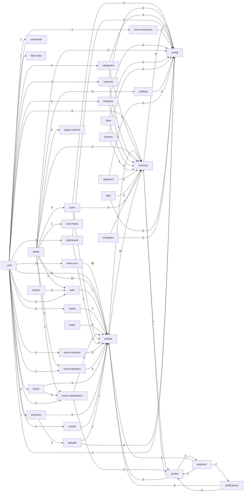

# API — phụ thuộc giữa các domain (`src/`)

> **Sinh tự động:** `2026-06-13T10:59:09.059Z` từ `snapshot/graph.json` (cạnh `relation: "imports"`).
> **Domain** = thư mục cấp một dưới `src/` (ví dụ `posts`, `users`). File trực tiếp trong `src/*.ts` gom vào domain `_root`.

Ý nghĩa: **domain hàng gọi (import) domain cột** — Nest module/controller/service trong một feature đang dùng code của feature khác hoặc layer dùng chung (`entities`, `common`, …).

## Bảng phụ thuộc chéo (gộp)

| Domain gọi | Domain được import | Số cạnh import | Ví dụ (tên file) |
|-------------|---------------------|----------------|------------------|
| `_root` | `accounts` | 1 | app.module.ts → accounts.module.ts |
| `_root` | `auth` | 1 | app.module.ts → auth.module.ts |
| `_root` | `cameras` | 1 | app.module.ts → cameras.module.ts |
| `_root` | `categories` | 1 | app.module.ts → categories.module.ts |
| `_root` | `comments` | 1 | app.module.ts → comments.module.ts |
| `_root` | `common` | 6 | app.module.ts → permissions.guard.ts; main.ts → logging.interceptor.ts; main.ts → database-http-exception.filter.ts; main.ts → request-id.middleware.ts |
| `_root` | `config` | 1 | main.ts → app.config.ts |
| `_root` | `dashboard` | 1 | app.module.ts → dashboard.module.ts |
| `_root` | `entities` | 27 | seed-full-export.ts → account.entity.ts; seed-full-export.ts → admission-result.entity.ts; seed-full-export.ts → category.entity.ts; seed-full-export.ts → comment.entity.ts |
| `_root` | `event-checkins` | 1 | app.module.ts → event-checkins.module.ts |
| `_root` | `event-checkouts` | 1 | app.module.ts → event-checkouts.module.ts |
| `_root` | `event-registrations` | 1 | app.module.ts → event-registrations.module.ts |
| `_root` | `event-speakers` | 1 | app.module.ts → event-speakers.module.ts |
| `_root` | `events` | 1 | app.module.ts → events.module.ts |
| `_root` | `face-data` | 1 | app.module.ts → face-data.module.ts |
| `_root` | `hanet` | 1 | app.module.ts → hanet.module.ts |
| `_root` | `locations` | 1 | app.module.ts → locations.module.ts |
| `_root` | `mikro-orm` | 3 | app.module.ts → mikro-orm.module.ts; seed-demo.ts → orm-entities.ts; seed-full-export.ts → orm-entities.ts |
| `_root` | `notifications` | 1 | app.module.ts → notifications.module.ts |
| `_root` | `page-contents` | 1 | app.module.ts → page-contents.module.ts |
| `_root` | `posts` | 1 | app.module.ts → posts.module.ts |
| `_root` | `proxy-image` | 1 | app.module.ts → proxy-image.module.ts |
| `_root` | `public` | 1 | app.module.ts → public.module.ts |
| `_root` | `roles` | 1 | app.module.ts → roles.module.ts |
| `_root` | `screens` | 1 | app.module.ts → screens.module.ts |
| `_root` | `seeds` | 2 | seed-demo.ts → checkin-demo.runner.ts; seed-superadmin.ts → superadmin-bootstrap.runner.ts |
| `_root` | `seo-metas` | 1 | app.module.ts → seo-metas.module.ts |
| `_root` | `sessions` | 1 | app.module.ts → sessions.module.ts |
| `_root` | `settings` | 1 | app.module.ts → settings.module.ts |
| `_root` | `socket` | 1 | app.module.ts → socket.module.ts |
| `_root` | `speakers` | 1 | app.module.ts → speakers.module.ts |
| `_root` | `system` | 1 | app.module.ts → system.module.ts |
| `_root` | `tags` | 1 | app.module.ts → tags.module.ts |
| `_root` | `templates` | 1 | app.module.ts → templates.module.ts |
| `_root` | `uploads` | 1 | app.module.ts → uploads.module.ts |
| `_root` | `users` | 1 | app.module.ts → users.module.ts |
| `accounts` | `entities` | 2 | accounts.service.ts → user.entity.ts; accounts.service.ts → user-role.entity.ts |
| `accounts` | `uploads` | 2 | accounts.controller.ts → uploads.service.ts; accounts.module.ts → uploads.module.ts |
| `auth` | `entities` | 7 | auth.service.spec.ts → user.entity.ts; auth.service.spec.ts → role.entity.ts; auth.service.spec.ts → user-role.entity.ts; auth.service.ts → user.entity.ts |
| `cameras` | `common` | 2 | cameras.controller.ts → permissions.decorator.ts; cameras.service.ts → admin-filter-configs.ts |
| `cameras` | `config` | 2 | cameras.controller.ts → permissions.ts; cameras.controller.ts → constants.ts |
| `cameras` | `entities` | 1 | cameras.service.ts → camera.entity.ts |
| `categories` | `common` | 3 | categories.controller.ts → permissions.decorator.ts; categories.service.ts → get-options.ts; categories.service.ts → admin-filter-configs.ts |
| `categories` | `config` | 2 | categories.controller.ts → permissions.ts; categories.controller.ts → constants.ts |
| `categories` | `entities` | 1 | categories.service.ts → category.entity.ts |
| `categories` | `notifications` | 1 | categories.module.ts → notifications.module.ts |
| `comments` | `entities` | 1 | comments.service.ts → comment.entity.ts |
| `comments` | `notifications` | 1 | comments.module.ts → notifications.module.ts |
| `common` | `auth` | 1 | permissions.guard.ts → auth.service.ts |
| `common` | `config` | 4 | api-access.middleware.ts → constants.ts; logging.interceptor.ts → app.config.ts; logging.interceptor.ts → constants.ts; permissions.guard.ts → constants.ts |
| `common` | `entities` | 22 | dev-login-options.ts → role.entity.ts; dev-login-options.ts → user.entity.ts; dev-login-options.ts → user-role.entity.ts; gift-rules.spec.ts → product.entity.ts |
| `common` | `socket` | 3 | admin-realtime-broadcast.service.ts → socket.gateway.ts; admin-realtime-broadcast.service.ts → socket.types.ts; admin-realtime.interceptor.ts → socket.gateway.ts |
| `dashboard` | `common` | 1 | dashboard.controller.ts → permissions.decorator.ts |
| `dashboard` | `config` | 2 | dashboard.controller.ts → permissions.ts; dashboard.controller.ts → constants.ts |
| `dashboard` | `entities` | 3 | dashboard.service.ts → category.entity.ts; dashboard.service.ts → post.entity.ts; dashboard.service.ts → post-category.entity.ts |
| `entities` | `common` | 3 | customer-cart.entity.ts → cart-types.ts; order.entity.ts → product-types.ts; product.entity.ts → product-types.ts |
| `event-checkins` | `entities` | 3 | event-checkins.service.ts → event-checkin.entity.ts; event-checkins.service.ts → event.entity.ts; event-checkins.service.ts → event-registration.entity.ts |
| `event-checkouts` | `common` | 1 | event-checkouts.controller.ts → permissions.decorator.ts |
| `event-checkouts` | `config` | 2 | event-checkouts.controller.ts → permissions.ts; event-checkouts.controller.ts → constants.ts |
| `event-registrations` | `entities` | 5 | event-registration-attendance.service.ts → event.entity.ts; event-registration-attendance.service.ts → event-registration.entity.ts; event-registrations.service.ts → event-registration.entity.ts; event-registrations.service.ts → event.entity.ts |
| `event-registrations` | `socket` | 2 | event-registration-attendance.service.ts → socket.gateway.ts; event-registrations.module.ts → socket.module.ts |
| `event-speakers` | `entities` | 3 | event-speakers.service.ts → event-speaker.entity.ts; event-speakers.service.ts → event.entity.ts; event-speakers.service.ts → speaker.entity.ts |
| `events` | `entities` | 2 | events.service.ts → event.entity.ts; events.service.ts → camera.entity.ts |
| `face-data` | `entities` | 1 | face-data.service.ts → face-data.entity.ts |
| `hanet` | `entities` | 3 | hanet-webhook.service.ts → event.entity.ts; hanet-webhook.service.ts → event-registration.entity.ts; hanet-webhook.service.ts → camera.entity.ts |
| `hanet` | `event-registrations` | 2 | hanet-webhook.service.ts → event-registration-attendance.service.ts; hanet.module.ts → event-registrations.module.ts |
| `locations` | `common` | 2 | locations.controller.ts → permissions.decorator.ts; locations.service.ts → admin-filter-configs.ts |
| `locations` | `config` | 2 | locations.controller.ts → permissions.ts; locations.controller.ts → constants.ts |
| `locations` | `entities` | 1 | locations.service.ts → location.entity.ts |
| `mikro-orm` | `entities` | 46 | orm-entities.ts → academic-year.entity.ts; orm-entities.ts → account.entity.ts; orm-entities.ts → admission-result.entity.ts; orm-entities.ts → camera.entity.ts |
| `notifications` | `entities` | 6 | notifications.service.spec.ts → notification.entity.ts; notifications.service.ts → notification.entity.ts; notifications.service.ts → user.entity.ts; notifications.service.ts → user-role.entity.ts |
| `notifications` | `socket` | 4 | notifications.module.ts → socket.module.ts; notifications.service.spec.ts → socket.gateway.ts; notifications.service.ts → socket.gateway.ts; notifications.service.ts → notification-mapper.ts |
| `page-contents` | `auth` | 1 | page-contents.module.ts → auth.module.ts |
| `page-contents` | `entities` | 1 | page-contents.service.ts → page-content.entity.ts |
| `page-contents` | `notifications` | 1 | page-contents.module.ts → notifications.module.ts |
| `posts` | `entities` | 6 | posts.service.ts → post.entity.ts; posts.service.ts → post-category.entity.ts; posts.service.ts → post-tag.entity.ts; posts.service.ts → category.entity.ts |
| `posts` | `notifications` | 1 | posts.module.ts → notifications.module.ts |
| `proxy-image` | `common` | 1 | proxy-image.controller.ts → public.decorator.ts |
| `proxy-image` | `config` | 1 | proxy-image.controller.ts → constants.ts |
| `public` | `auth` | 3 | public-auth.service.ts → auth.service.ts; public.controller.ts → auth.service.ts; public.module.ts → auth.module.ts |
| `public` | `common` | 3 | public-contact-requests.service.ts → admin-realtime-broadcast.service.ts; public.controller.ts → api-response.ts; public.controller.ts → public.decorator.ts |
| `public` | `config` | 2 | public-contact-requests.service.ts → constants.ts; public.controller.ts → constants.ts |
| `public` | `entities` | 15 | public-auth.service.ts → role.entity.ts; public-auth.service.ts → setting.entity.ts; public-auth.service.ts → user.entity.ts; public-categories.service.ts → category.entity.ts |
| `public` | `event-registrations` | 3 | public-event-registration.service.ts → event-registrations.service.ts; public-events.service.ts → event-registrations.service.ts; public.module.ts → event-registrations.module.ts |
| `public` | `event-speakers` | 2 | public-events.service.ts → event-speakers.service.ts; public.module.ts → event-speakers.module.ts |
| `public` | `page-contents` | 2 | public.controller.ts → page-contents.service.ts; public.module.ts → page-contents.module.ts |
| `public` | `seo-metas` | 2 | public.controller.ts → seo-metas.service.ts; public.module.ts → seo-metas.module.ts |
| `public` | `settings` | 2 | public.controller.ts → settings.service.ts; public.module.ts → settings.module.ts |
| `public` | `socket` | 1 | public.module.ts → socket.module.ts |
| `public` | `users` | 3 | public-auth.service.ts → users.service.ts; public.controller.ts → users.service.ts; public.module.ts → users.module.ts |
| `roles` | `common` | 2 | roles.controller.ts → permissions.decorator.ts; roles.service.ts → get-options.ts |
| `roles` | `config` | 2 | roles.controller.ts → permissions.ts; roles.controller.ts → constants.ts |
| `roles` | `entities` | 1 | roles.service.ts → role.entity.ts |
| `roles` | `notifications` | 1 | roles.module.ts → notifications.module.ts |
| `roles` | `socket` | 1 | roles.module.ts → socket.module.ts |
| `screens` | `common` | 2 | screens.controller.ts → permissions.decorator.ts; screens.service.ts → admin-filter-configs.ts |
| `screens` | `config` | 2 | screens.controller.ts → permissions.ts; screens.controller.ts → constants.ts |
| `screens` | `entities` | 1 | screens.service.ts → screen.entity.ts |
| `scripts` | `mikro-orm` | 1 | mark-migrations-executed.ts → mikro-orm.module.ts |
| `seeders` | `seeds` | 1 | DatabaseSeeder.ts → superadmin-bootstrap.runner.ts |
| `seeds` | `config` | 1 | superadmin-bootstrap.data.ts → event-staff.template.ts |
| `seeds` | `entities` | 7 | checkin-demo.runner.ts → event.entity.ts; checkin-demo.runner.ts → event-registration.entity.ts; checkin-demo.runner.ts → user.entity.ts; superadmin-bootstrap.runner.ts → user.entity.ts |
| `seo-metas` | `common` | 1 | seo-metas.service.ts → admin-filter-configs.ts |
| `seo-metas` | `entities` | 1 | seo-metas.service.ts → seo-meta.entity.ts |
| `sessions` | `config` | 1 | sessions.service.ts → constants.ts |
| `sessions` | `entities` | 4 | sessions.service.ts → session.entity.ts; sessions.service.ts → user.entity.ts; sessions.service.ts → user-role.entity.ts; sessions.service.ts → role.entity.ts |
| `sessions` | `notifications` | 2 | sessions.controller.ts → notifications.service.ts; sessions.module.ts → notifications.module.ts |
| `sessions` | `socket` | 2 | sessions.controller.ts → socket.gateway.ts; sessions.module.ts → socket.module.ts |
| `settings` | `common` | 1 | settings.controller.ts → permissions.decorator.ts |
| `settings` | `config` | 2 | settings.controller.ts → permissions.ts; settings.controller.ts → constants.ts |
| `settings` | `entities` | 1 | settings.service.ts → setting.entity.ts |
| `socket` | `common` | 3 | socket.gateway.ts → entity-id.ts; socket.module.ts → admin-realtime.interceptor.ts; socket.module.ts → admin-realtime-broadcast.service.ts |
| `socket` | `config` | 1 | socket.gateway.ts → app.config.ts |
| `socket` | `entities` | 2 | socket.gateway.ts → notification.entity.ts; socket.gateway.ts → user.entity.ts |
| `socket` | `sessions` | 2 | socket.gateway.ts → sessions.service.ts; socket.module.ts → sessions.module.ts |
| `speakers` | `common` | 2 | speakers.controller.ts → permissions.decorator.ts; speakers.service.ts → admin-filter-configs.ts |
| `speakers` | `config` | 2 | speakers.controller.ts → permissions.ts; speakers.controller.ts → constants.ts |
| `speakers` | `entities` | 1 | speakers.service.ts → speaker.entity.ts |
| `system` | `auth` | 2 | system.controller.ts → auth.service.ts; system.module.ts → auth.module.ts |
| `system` | `mikro-orm` | 1 | system.service.ts → orm-entities.ts |
| `system` | `seeds` | 1 | system.service.ts → superadmin-bootstrap.runner.ts |
| `tags` | `common` | 2 | tags.controller.ts → permissions.decorator.ts; tags.service.ts → get-options.ts |
| `tags` | `config` | 2 | tags.controller.ts → permissions.ts; tags.controller.ts → constants.ts |
| `tags` | `entities` | 1 | tags.service.ts → tag.entity.ts |
| `tags` | `notifications` | 1 | tags.module.ts → notifications.module.ts |
| `templates` | `common` | 2 | templates.controller.ts → permissions.decorator.ts; templates.service.ts → admin-filter-configs.ts |
| `templates` | `config` | 2 | templates.controller.ts → permissions.ts; templates.controller.ts → constants.ts |
| `templates` | `entities` | 1 | templates.service.ts → template.entity.ts |
| `uploads` | `common` | 1 | public-uploads.controller.ts → public.decorator.ts |
| `uploads` | `config` | 2 | public-uploads.controller.ts → constants.ts; uploads.service.ts → app.config.ts |
| `uploads` | `entities` | 2 | uploads.service.ts → storage-file.entity.ts; uploads.service.ts → user.entity.ts |
| `users` | `common` | 2 | users.controller.ts → permissions.decorator.ts; users.service.ts → dev-login-options.ts |
| `users` | `config` | 3 | users.controller.ts → permissions.ts; users.controller.ts → constants.ts; users.service.ts → protected-admin.ts |
| `users` | `entities` | 4 | users.service.ts → user.entity.ts; users.service.ts → role.entity.ts; users.service.ts → user-role.entity.ts; users.service.ts → setting.entity.ts |
| `users` | `notifications` | 1 | users.module.ts → notifications.module.ts |
| `users` | `sessions` | 1 | users.module.ts → sessions.module.ts |
| `users` | `socket` | 1 | users.module.ts → socket.module.ts |

## Domain trung tâm (chiều ngược: ai import vào domain này?)

Liệt kê domain **đích** (`to`) được nhiều cạnh `imports` nhất; kèm các domain **nguồn** (`from`) nổi bật.

- **`entities`**: **182** cạnh từ **32** domain — `mikro-orm` (46), `_root` (27), `common` (22), `public` (15), `auth` (7), `seeds` (7), `notifications` (6), `posts` (6)
- **`common`**: **40** cạnh từ **19** domain — `_root` (6), `categories` (3), `entities` (3), `public` (3), `socket` (3), `cameras` (2), `locations` (2), `roles` (2)
- **`config`**: **38** cạnh từ **20** domain — `common` (4), `users` (3), `cameras` (2), `categories` (2), `dashboard` (2), `event-checkouts` (2), `locations` (2), `public` (2)
- **`socket`**: **15** cạnh từ **8** domain — `notifications` (4), `common` (3), `event-registrations` (2), `sessions` (2), `_root` (1), `public` (1), `roles` (1), `users` (1)
- **`notifications`**: **10** cạnh từ **9** domain — `sessions` (2), `_root` (1), `categories` (1), `comments` (1), `page-contents` (1), `posts` (1), `roles` (1), `tags` (1)
- **`auth`**: **8** cạnh từ **5** domain — `public` (3), `system` (2), `_root` (1), `common` (1), `page-contents` (1)
- **`event-registrations`**: **6** cạnh từ **3** domain — `public` (3), `hanet` (2), `_root` (1)
- **`mikro-orm`**: **5** cạnh từ **3** domain — `_root` (3), `scripts` (1), `system` (1)
- **`seeds`**: **4** cạnh từ **3** domain — `_root` (2), `seeders` (1), `system` (1)
- **`sessions`**: **4** cạnh từ **3** domain — `socket` (2), `_root` (1), `users` (1)
- **`users`**: **4** cạnh từ **2** domain — `public` (3), `_root` (1)
- **`event-speakers`**: **3** cạnh từ **2** domain — `public` (2), `_root` (1)
- **`page-contents`**: **3** cạnh từ **2** domain — `public` (2), `_root` (1)
- **`seo-metas`**: **3** cạnh từ **2** domain — `public` (2), `_root` (1)
- **`settings`**: **3** cạnh từ **2** domain — `public` (2), `_root` (1)
- **`uploads`**: **3** cạnh từ **2** domain — `accounts` (2), `_root` (1)
- **`accounts`**: **1** cạnh từ **1** domain — `_root` (1)
- **`cameras`**: **1** cạnh từ **1** domain — `_root` (1)
- **`categories`**: **1** cạnh từ **1** domain — `_root` (1)
- **`comments`**: **1** cạnh từ **1** domain — `_root` (1)
- **`dashboard`**: **1** cạnh từ **1** domain — `_root` (1)
- **`event-checkins`**: **1** cạnh từ **1** domain — `_root` (1)
- **`event-checkouts`**: **1** cạnh từ **1** domain — `_root` (1)
- **`events`**: **1** cạnh từ **1** domain — `_root` (1)
- **`face-data`**: **1** cạnh từ **1** domain — `_root` (1)
- **`hanet`**: **1** cạnh từ **1** domain — `_root` (1)
- **`locations`**: **1** cạnh từ **1** domain — `_root` (1)
- **`posts`**: **1** cạnh từ **1** domain — `_root` (1)
- **`proxy-image`**: **1** cạnh từ **1** domain — `_root` (1)
- **`public`**: **1** cạnh từ **1** domain — `_root` (1)
- **`roles`**: **1** cạnh từ **1** domain — `_root` (1)
- **`screens`**: **1** cạnh từ **1** domain — `_root` (1)
- **`speakers`**: **1** cạnh từ **1** domain — `_root` (1)
- **`system`**: **1** cạnh từ **1** domain — `_root` (1)
- **`tags`**: **1** cạnh từ **1** domain — `_root` (1)

## Sơ đồ Mermaid (tối đa 80 cặp domain, ưu tiên cạnh có trọng số lớn)

## Ghi chú

- Chỉ liệt kê import **nội bộ** giữa file dưới `src/` (theo snapshot Graphify). Import package npm có thể không xuất hiện.
- Để biết **HTTP route** giữa client và API, xem controller + `SUMMARY_FOR_AI.md` (module map).

## Làm mới

Chạy `node script-system/graphify/graphify-update.cjs apps/hub-event/api` rồi `pnpm graphify:ai-summary` (hoặc `pnpm graphify:refresh`).
