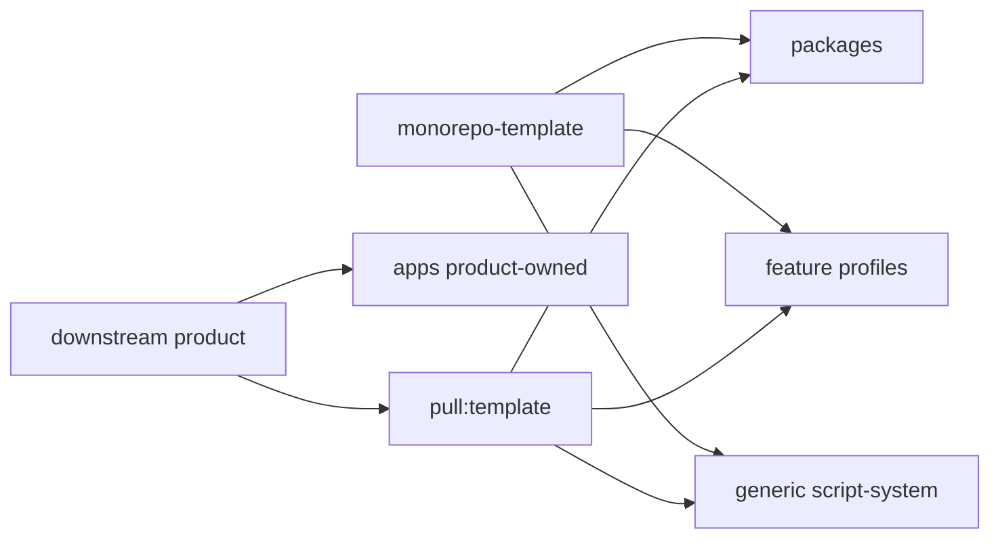

# Cấu trúc Feature-Template

`monorepo-template` là upstream dùng chung cho nhiều product. Repo này không chứa `apps/`.

```text
monorepo-template/
├── packages/
│   ├── admin-app/
│   ├── api-client/
│   ├── api-server/
│   ├── query-client/
│   ├── ui/
│   └── ...
├── script-system/
│   ├── admin/
│   ├── git/
│   ├── lib/
│   ├── sync/
│   ├── template/
│   └── verify/
├── docs/
├── template.manifest.json
├── package.json
└── pnpm-workspace.yaml
```

## Ranh Giới

- `packages/*` là source dùng chung.
- Product-line profiles cấu hình module/API/admin/permissions cho từng product.
- `script-system` chỉ giữ generic tooling tối thiểu.
- `apps/` thuộc downstream product, không commit trong template.
- Deploy/runtime scripts thuộc downstream product.

## Luồng Đồng Bộ



## Workspace

Upstream chỉ include:

```yaml
packages:
  - "packages/*"
```

Product repo tự thêm workspace pattern cho app của họ.

## Kiểm Tra

```bash
pnpm check
pnpm verify:scripts
pnpm verify:api-template
```
