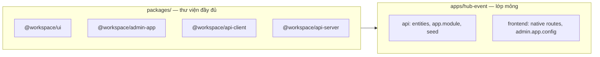

# Monorepo template — full thư viện `packages/`

Repo **`mono-repo-template`** cung cấp **toàn bộ thư viện** trong `packages/`.  
Monorepo sản phẩm (hub-event, hub-parent, …) **chỉ giữ `apps/<line>/`** + kéo `packages/` qua `pnpm pull:template`.

## Nguyên tắc



| Tầng | Chứa gì | Không chứa |
|------|---------|------------|
| **`packages/`** | UI, admin CRUD, API client, base Nest CRUD, editor, config | Entity DB, env deploy, route native |
| **`apps/<line>/api`** | Entity, migration, `app.module.ts`, controller đặc thù | Copy logic CRUD từ main |
| **`apps/<line>/*-frontend`** | Native pages, `admin.app.config.json`, re-export generate | Component admin local |

**Cấm trên downstream:** `apps/main/`, sync copy `main/api` → `hub-event/api` (`pull:checkin` legacy).

Catalog package: [`packages/README.md`](../packages/README.md).

---

## Upstream (repo template) — dev

```bash
git checkout main
# Sửa packages/* trước khi sửa apps
pnpm check
pnpm push -- "feat: ..."
git tag template/v2026.06.12 && git push origin template/v2026.06.12
```

| Thư mục | Vai trò |
|---------|---------|
| `packages/` | **Source of truth** — thư viện đầy đủ |
| `apps/main/` | Sandbox dev API + admin đầy đủ |
| `apps/hub-event`, `hub-parent` | Reference để `init:downstream` — không deploy từ đây |

---

## Downstream (repo sản phẩm)

### Tạo mới

```bash
node script-system/sync/init-downstream.cjs hub-event ../hub-event-monorepo
cd ../hub-event-monorepo
pnpm install
pnpm verify:template-downstream
pnpm check
```

### Cập nhật thư viện

```bash
pnpm pull:template
# hoặc pin tag:
pnpm pull:template -- --ref template/v2026.06.12
pnpm install
pnpm verify:template-downstream
pnpm check
pnpm push -- "chore: sync template"
```

`pull:template` luôn checkout **cả thư mục `packages/`** — không subset.

### API check-in (packages-first)

```bash
# Sau khi đổi api.app.config.json
pnpm api:generate:checkin
pnpm verify:checkin-api
```

Service extend `@workspace/api-server` — không copy từ `apps/main/api`.

### Admin check-in

```bash
pnpm admin:generate:checkin
pnpm verify:checkin-admin
```

Module CRUD từ `@workspace/admin-app`.

---

## So sánh legacy vs packages-first

| | Legacy (1 repo, sync main→hub-event) | Packages-first (template) |
|---|--------------------------------------|---------------------------|
| Thư viện | Trùng lặp qua sync API | `packages/` một nguồn |
| Deploy | Branch full monorepo | Repo nhỏ: apps + packages |
| Cập nhật feature | pull:checkin + conflict | pull:template |
| Dev feature | apps/main + sync | packages/ trên template → pull downstream |

Legacy vẫn có trên template cho chuyển đổi dần:

```bash
pnpm push:legacy -- "..."      # branch deploy — deprecated
pnpm push:checkin -- "..."     # một line — deprecated
```

---

## Manifest

`template.manifest.json`:

- `library.root` = `"packages"`, `pullMode` = `"full"`
- `inheritPaths` — luôn có `"packages"` đầu tiên
- Downstream: `"role": "downstream"`, `"productLine": "hub-event"`

Verify: `pnpm verify:template-downstream`

---

## Checklist agent

1. Feature UI/admin → `packages/ui` / `packages/admin-app`
2. Feature API client → `packages/api-client`
3. CRUD Nest dùng chung → `packages/api-server`
4. Chỉ entity/module composition → `apps/<line>/api`
5. Downstream **không** sửa packages lâu dài — PR lên template upstream
