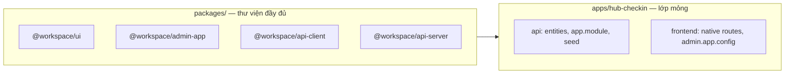

# Monorepo template — full thư viện `packages/`

Repo **`mono-repo-template`** cung cấp **toàn bộ thư viện** trong `packages/`.  
Monorepo sản phẩm (hub-checkin, hub-parent, …) **chỉ giữ `apps/<line>/`** + kéo `packages/` qua `pnpm pull:template`.

## Nguyên tắc



| Tầng | Chứa gì | Không chứa |
|------|---------|------------|
| **`packages/`** | UI, admin CRUD, API client, base Nest CRUD, editor, config | Entity DB, env deploy, route native |
| **`apps/<line>/api`** | Entity, migration, `app.module.ts`, controller đặc thù | Copy logic CRUD từ main |
| **`apps/<line>/*-frontend`** | Native pages, `admin.app.config.json`, re-export generate | Component admin local |

**Cấm trên downstream:** `apps/main/`, sync copy `main/api` → `hub-checkin/api` (`pull:checkin` legacy).

Catalog package: [`packages/README.md`](../packages/README.md).

---

## Repo code chính: **hub-checkin-monorepo**

Sản phẩm check-in là **primary** (`primaryProductLine: hub-checkin`):

| Repo | Vai trò |
|------|---------|
| **hub-checkin-monorepo** | Dev + deploy hàng ngày — `apps/hub-checkin` + full `packages/` |
| **mono-repo-template** | Cập nhật thư viện — sửa `packages/admin-app`, `packages/api-server` → tag → `pull:template` |

### Compose

- **`@workspace/admin-app`** → frontend admin (kéo ui, api-client, query-client, editor, …)
- **`@workspace/api-server`** → API Nest scaffold (generate vào `apps/hub-checkin/api`)

Apps chỉ: entities, `app.module.ts`, route native, config JSON.

### Bootstrap (một lần)

```bash
pnpm init:downstream hub-checkin ../hub-checkin-monorepo
cd ../hub-checkin-monorepo
pnpm install
pnpm build:packages
pnpm env:init checkin
pnpm dev:checkin
```

---

## Upstream (repo template) — cập nhật thư viện

```bash
git checkout main
# Sửa packages/* trước khi sửa apps
pnpm check
pnpm push -- "feat: ..."
git tag template/v2026.06.12 && git push origin template/v2026.06.12
```

| Thư mục | Vai trò |
|---------|---------|
| `packages/` | **Source of truth** — thư viện đầy đủ |
| `apps/main/` | Sandbox dev API + admin đầy đủ |
| `apps/hub-checkin`, `hub-parent` | Reference để `init:downstream` — không deploy từ đây |

---

## Downstream (repo sản phẩm)

### Quy tắc: template upstream trước

1. Sửa **`mono-repo-template`** (`packages/`, `script-system/`) → `pnpm check` → `pnpm push`
2. Trên repo deploy → **`pnpm sync`** (không chỉ `pull:template`)

`pnpm sync` = `pull:template` + `post-pull:downstream` (install, build packages, sync theo product line).

### Tạo mới

```bash
node script-system/sync/init-downstream.cjs hub-checkin ../hub-checkin-monorepo
cd ../hub-checkin-monorepo
pnpm install
pnpm verify:template-downstream
pnpm check
```

### Cập nhật thư viện

```bash
# Trên mono-repo-template (upstream) — LUÔN TRƯỚC:
pnpm check
pnpm push -- "feat: ..."

# Trên hub-*-monorepo (downstream):
pnpm sync
# hoặc pin tag:
pnpm pull:template -- --ref template/v2026.06.12
pnpm post-pull:downstream
pnpm check
pnpm push -- "chore: sync template"
```

`pull:template` chỉ checkout `packages/`, **script-system runtime subset**, docs — **không** đủ một mình.  
`post-pull:downstream` chạy install + build + `pull:checkin` (hub-checkin) theo profile.

`pull:template` luôn checkout **cả thư mục `packages/`** — không subset.
`script-system` trên downstream là allowlist để chạy dev/sync/verify/env/db/git; không kéo `graphify`, `template`, `api` tooling hay `sync/deprecated`.
`apps/*` là product-specific và downstream giữ local; template chỉ dùng app reference để bootstrap/migration có chủ đích.
`.graphify` là generated cache, không kéo qua template sync mặc định; khi cần thì chạy `pnpm graphify:refresh` tại repo hiện tại.

Local dev helper `apply-sync-to-downstream.cjs` mặc định chỉ copy shared boundary. Flag hiếm dùng:

```bash
node script-system/sync/apply-sync-to-downstream.cjs hub-checkin ../hub-checkin-monorepo
node script-system/sync/apply-sync-to-downstream.cjs hub-checkin ../hub-checkin-monorepo --with-apps
node script-system/sync/apply-sync-to-downstream.cjs hub-checkin ../hub-checkin-monorepo --with-graphify
```

### Sau sync: phân tích rồi mới sửa

Sau `pnpm sync`, không tạo code mới ngay. Bắt buộc:

1. Xem diff/source vừa đồng bộ vào downstream.
2. Kiểm tra trong `packages/`, `script-system/`, `apps/<line>/` xem tính năng/helper/component/API đã có sẵn chưa.
3. Ưu tiên reuse hoặc bật bằng config (`api.app.config.json`, `admin.app.config.json`, env, script hiện có).
4. Chỉ viết code mới khi đã xác định còn thiếu hành vi thật sự; nếu thiếu ở lớp dùng chung, quay lại sửa `mono-repo-template` trước.

### API check-in (packages-first)

```bash
# Sau khi đổi api.app.config.json
pnpm api:generate:checkin
pnpm verify:checkin-api
```

Service extend `@workspace/api-server` — không copy từ `apps/main/api`.

### Admin check-in

```bash
pnpm admin:generate:checkin
pnpm verify:checkin-admin
```

Module CRUD từ `@workspace/admin-app`.

---

## So sánh legacy vs packages-first

| | Legacy (1 repo, sync main→hub-checkin) | Packages-first (template) |
|---|--------------------------------------|---------------------------|
| Thư viện | Trùng lặp qua sync API | `packages/` một nguồn |
| Deploy | Branch full monorepo | Repo nhỏ: apps + packages |
| Cập nhật feature | pull:checkin + conflict | pull:template |
| Dev feature | apps/main + sync | packages/ trên template → pull downstream |

Legacy vẫn có trên template cho chuyển đổi dần:

```bash
pnpm push:legacy -- "..."      # branch deploy — deprecated
pnpm push:checkin -- "..."     # một line — deprecated
```

---

## Manifest

`template.manifest.json`:

- `library.root` = `"packages"`, `pullMode` = `"full"`
- `inheritPaths` — luôn có `"packages"` đầu tiên
- Downstream: `"role": "downstream"`, `"productLine": "hub-checkin"`

Verify: `pnpm verify:template-downstream`

---

## Checklist agent

1. Feature UI/admin → `packages/ui` / `packages/admin-app`
2. Feature API client → `packages/api-client`
3. CRUD Nest dùng chung → `packages/api-server`
4. Chỉ entity/module composition → `apps/<line>/api`
5. Downstream **không** sửa packages lâu dài — PR lên template upstream
