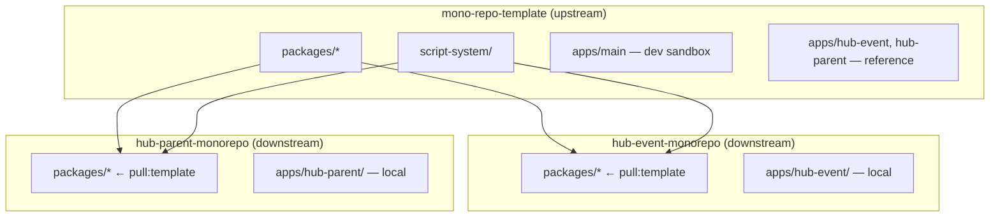

# Monorepo template — kế thừa packages, apps = sản phẩm

Repo **`mono-repo-template`** (upstream) là **nền kế thừa**. Các monorepo sản phẩm (hub-event, hub-parent, …) là **downstream**: giữ `apps/<line>/`, kéo `packages/` + `script-system/` từ template.

## Sơ đồ



## Vai trò

| Repo | `template.manifest.json` | Dev | Deploy |
|------|--------------------------|-----|--------|
| **Template (repo này)** | `"role": "upstream"` | `apps/main` + `packages` | Không deploy trực tiếp — tag/release cho downstream |
| **hub-event-monorepo** | `"role": "downstream"` | `apps/hub-event` + packages kế thừa | PM2 check-in, clone repo sản phẩm |
| **hub-parent-monorepo** | `"role": "downstream"` | `apps/hub-parent` + packages | PM2 site chính |

## Quy tắc vàng

1. **Feature / UI / admin / API client** → sửa **`packages/*`** trên template, merge xuống downstream bằng `pnpm pull:template`.
2. **`apps/main`** → chỉ trên template (API/admin đầy đủ).
3. **`apps/hub-event`**, **`apps/hub-parent`** trên template → **reference** để `init:downstream`; bản deploy sống trong repo sản phẩm riêng.
4. **Downstream không fork-sửa lâu dài `packages/`** — PR ngược lên template.

---

## Trên template (upstream) — hàng ngày

```bash
git checkout main
# sửa apps/main + packages
pnpm check
pnpm push -- "feat: ..."
```

`pnpm push` trên template **chỉ push `main`** (không sync branch deploy — giảm mệt quản lý).

Cập nhật downstream sau release:

```bash
git tag template/v2026.06.12
git push origin template/v2026.06.12
```

---

## Tạo monorepo sản phẩm mới

```bash
# Từ root template
node script-system/sync/init-downstream.cjs hub-event ../hub-event-monorepo
cd ../hub-event-monorepo
pnpm install
pnpm check
git remote add origin git@github.com:org/hub-event-monorepo.git
git add -A && git commit -m "chore: init hub-event downstream"
git push -u origin main
```

Tương tự `hub-parent`, `store-sync` (xem `template.manifest.json` → `productLines`).

---

## Downstream — cập nhật từ template

```bash
pnpm pull:template
# hoặc pin tag:
pnpm pull:template -- --ref template/v2026.06.12
pnpm install
pnpm check
pnpm push -- "chore: sync template v2026.06.12"
```

File `.template-lock.json` ghi revision đã kéo.

---

## Transitional — vẫn 1 repo (legacy)

Nếu chưa tách repo sản phẩm, sync branch deploy cũ:

```bash
pnpm push:legacy -- "feat: ..."     # commit + sync hub-event + hub-parent + push branch
pnpm push:checkin -- "feat: ..."    # chỉ line check-in
pnpm push:parent -- "feat: ..."    # chỉ line site chính
```

Khuyến nghị: **chuyển sang repo downstream** thay vì duy trì branch `hub-event` / `hub-parent` trên template.

---

## Manifest

`template.manifest.json` tại root:

- `inheritPaths` — thư mục kéo từ template
- `keepPaths` — không ghi đè (luôn có `apps/`)
- `productLines` — cấu hình `init:downstream`

---

## So sánh với mô hình cũ

| | Cũ (1 repo, 3 branch) | Template + downstream |
|---|------------------------|------------------------|
| Deploy check-in | `git pull origin hub-event` (full monorepo) | Clone **repo hub-event** nhỏ |
| Push dev | Sync 2 line mỗi lần | Push **main** template only |
| Packages | Cùng repo, dễ lẫn | Kéo có kiểm soát `pull:template` |
| Mental load | Cao | Thấp |

Chi tiết product line cũ: [`MONOREPO_STRUCTURE.md`](MONOREPO_STRUCTURE.md).
