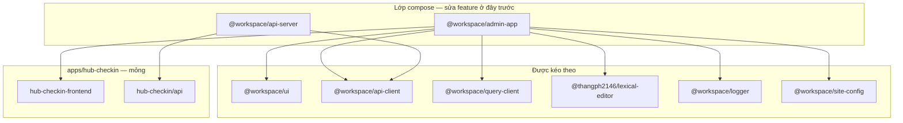

# `packages/` — thư viện đầy đủ (mono-repo-template)

Downstream (**hub-event-monorepo** — repo code chính) kéo **toàn bộ** thư mục này qua `pnpm pull:template`.

## Lớp compose — 2 package gốc

Hầu hết tính năng template đi qua **`admin-app`** (Next admin) và **`api-server`** (Nest API):



| Package compose | App hub-event dùng qua |
|-----------------|-------------------------|
| **`@workspace/admin-app`** | `admin.app.config.json` + `pnpm admin:generate:checkin` |
| **`@workspace/api-server`** | `api.app.config.json` + `pnpm api:generate:checkin` |

## Bản đồ package

| Package | Vai trò |
|---------|---------|
| **`@workspace/admin-app`** | CRUD admin modules + routing shared |
| **`@workspace/api-server`** | Base Nest CRUD + domain modules |
| `@workspace/ui` | Component admin/storefront |
| `@workspace/api-client` | SDK HTTP + permissions |
| `@workspace/query-client` | TanStack Query |
| `@workspace/logger` | Logging |
| `@workspace/site-config` | Site metadata |
| `@thangph2146/lexical-editor` | Rich text |
| `@workspace/promo-codes` | Promo (store lines) |
| `@workspace/dealer-support` | Dealer helpers |
| `@workspace/eslint-config` | ESLint |
| `@workspace/typescript-config` | TS config |

Graph: [`packages/.graphify/markdown/PACKAGE_INDEX.md`](.graphify/markdown/PACKAGE_INDEX.md).

## Ranh giới

| Việc | Package | App hub-event |
|------|---------|---------------|
| Component admin | `packages/ui` | re-export generate |
| Page CRUD admin | `packages/admin-app` | `admin.app.config.json` |
| Gọi API | `packages/api-client` | không fetch trực tiếp |
| Service CRUD Nest | `packages/api-server` | extend + generate |
| Entity, migration | — | `apps/hub-checkin/api` |
| Route native check-in | — | `apps/hub-checkin/...-frontend` |

## Workflow

**Template upstream** (cập nhật thư viện):

```bash
# sửa packages/admin-app hoặc packages/api-server
pnpm check && pnpm push -- "feat: ..."
git tag template/vX && git push origin template/vX
```

**Hub-event-monorepo** (repo chính):

```bash
pnpm pull:template
pnpm build:packages
pnpm admin:generate:checkin && pnpm api:generate:checkin
pnpm check
```

Doc: [`docs/TEMPLATE_MONOREPO.md`](../docs/TEMPLATE_MONOREPO.md).
