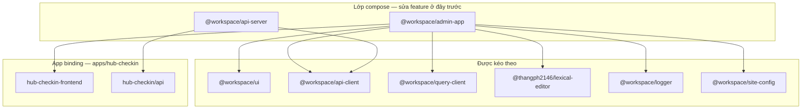

# `packages/` — shared platform packages

Downstream (**hub-checkin-monorepo**, **hub-parent-monorepo**, **store-sync-monorepo**) kéo **toàn bộ** thư mục này qua `pnpm pull:template`.

`packages/` không phải nơi đặt source deploy line. Package chỉ giữ runtime/shared library và tooling render dùng chung; cấu hình riêng từng app nằm trong `apps/*`.

## Lớp Compose

Hầu hết tính năng template đi qua **`admin-app`** (Next admin) và **`api-server`** (Nest API). App cụ thể chỉ compose/generate phần cần dùng.



| Package compose | App dùng qua |
|-----------------|-------------------------|
| **`@workspace/admin-app`** | `admin.app.config.json` + `pnpm admin:generate:checkin` |
| **`@workspace/api-server`** | `api.app.config.json` + `pnpm api:generate:checkin` |

## Bản đồ package

| Package | Vai trò |
|---------|---------|
| **`@workspace/admin-app`** | CRUD admin modules + routing shared |
| **`@workspace/api-server`** | Base Nest CRUD + domain modules |
| `@workspace/ui` | Component admin/storefront |
| `@workspace/api-client` | SDK HTTP + permissions |
| `@workspace/query-client` | TanStack Query |
| `@workspace/logger` | Logging |
| `@workspace/site-config` | Site metadata |
| `@thangph2146/lexical-editor` | Rich text |
| `@workspace/promo-codes` | Promo (store lines) |
| `@workspace/dealer-support` | Dealer helpers |
| `@workspace/eslint-config` | ESLint |
| `@workspace/typescript-config` | TS config |

Graph: [`packages/.graphify/markdown/PACKAGE_INDEX.md`](.graphify/markdown/PACKAGE_INDEX.md).

## Ranh giới

| Việc | Package | App binding |
|------|---------|---------------|
| Component admin | `packages/ui` | re-export generate |
| Page CRUD admin | `packages/admin-app` | `admin.app.config.json` |
| Gọi API | `packages/api-client` | không fetch trực tiếp |
| Service CRUD Nest | `packages/api-server` | extend + generate |
| Entity, migration | — | `apps/hub-checkin/api` |
| Route native check-in | — | `apps/hub-checkin/...-frontend` |

## Boundary `api-server`

`@workspace/api-server` có 3 lớp, không trộn lẫn:

| Lớp | Đường dẫn | Quy tắc |
|-----|-----------|---------|
| Runtime shared | `packages/api-server/src/**` | Không hard-code deploy line như `hub-checkin`, `hub-parent`, `store-sync`, không trỏ `apps/hub-*` hoặc `apps/store-*` |
| Deploy/render tooling | `packages/api-server/deploy/**` | Được đọc `api.app.config.json`, materialize app binding |
| App binding | `apps/*/api/api.app.config.json` + `apps/*/api/src/**` | Khai báo product line: modules, extraModules, excludeModules, native overrides |

Nếu cần bật/tắt module theo deploy line, ưu tiên sửa `apps/<line>/api/api.app.config.json`. Không thêm nhánh product line vào `packages/api-server/src/**`.

## Workflow

**Template upstream** (cập nhật thư viện):

```bash
# sửa packages/admin-app hoặc packages/api-server
pnpm check && pnpm push -- "feat: ..."
git tag template/vX && git push origin template/vX
```

**Hub-checkin-monorepo** (repo chính):

```bash
pnpm pull:template
pnpm build:packages
pnpm admin:generate:checkin && pnpm api:generate:checkin
pnpm check
```

Doc: [`docs/TEMPLATE_MONOREPO.md`](../docs/TEMPLATE_MONOREPO.md).
